# Resilience4j PoC - 電子商務訂單服務韌性機制

[](./gradlew)
[](https://openjdk.org/)
[](https://spring.io/projects/spring-boot)
[](https://resilience4j.readme.io/)

## 專案目的

本專案是一個 **Resilience4j 韌性機制概念驗證 (PoC)**，展示如何在微服務架構中實現服務韌性。透過模擬電子商務訂單服務，示範三種核心韌性模式：

| 模式 | 目的 | 應用場景 |
|------|------|----------|
| **Retry（重試）** | 處理暫時性故障 | 庫存服務網路抖動 |
| **CircuitBreaker（斷路器）** | 防止雪崩效應 | 支付閘道持續故障 |
| **TimeLimiter（超時控制）** | 保護資源不被阻塞 | 物流服務慢回應 |

## 專案狀態

| 階段 | 狀態 | 說明 |
|------|------|------|
| 規格設計 | ✅ 完成 | spec.md, plan.md, tasks.md |
| Domain Layer | ✅ 完成 | Order, OrderItem, Value Objects |
| Application Layer | ✅ 完成 | Ports, Use Cases, OrderService |
| Infrastructure Layer | ✅ 完成 | Adapters, Resilience4j 配置 |
| 單元測試 | ✅ 完成 | 36 項測試全數通過 |
| API 文件 | ✅ 完成 | Swagger UI |

---

## 快速開始

### 環境需求

- Java 17+
- Gradle 8.x

### 建置與執行

```bash
# 建置專案
./gradlew build

# 執行測試
./gradlew test

# 啟動服務
./gradlew bootRun
```

### 存取服務

| 端點 | URL |
|------|-----|
| Swagger UI | http://localhost:8080/swagger-ui.html |
| API Docs | http://localhost:8080/api-docs |
| Health Check | http://localhost:8080/actuator/health |
| Prometheus Metrics | http://localhost:8080/actuator/prometheus |

### 測試 API

```bash
curl -X POST http://localhost:8080/api/orders \
  -H "Content-Type: application/json" \
  -d '{
    "items": [
      {"skuCode": "SKU001", "quantity": 2, "unitPrice": 1500.00}
    ],
    "shippingAddress": "台北市信義區松仁路100號"
  }'
```

---

## 系統架構

### C4 Model - System Context

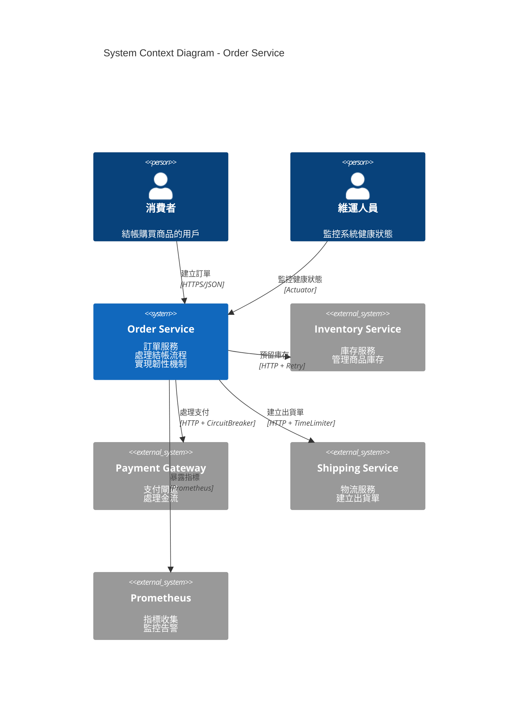

### C4 Model - Container Diagram

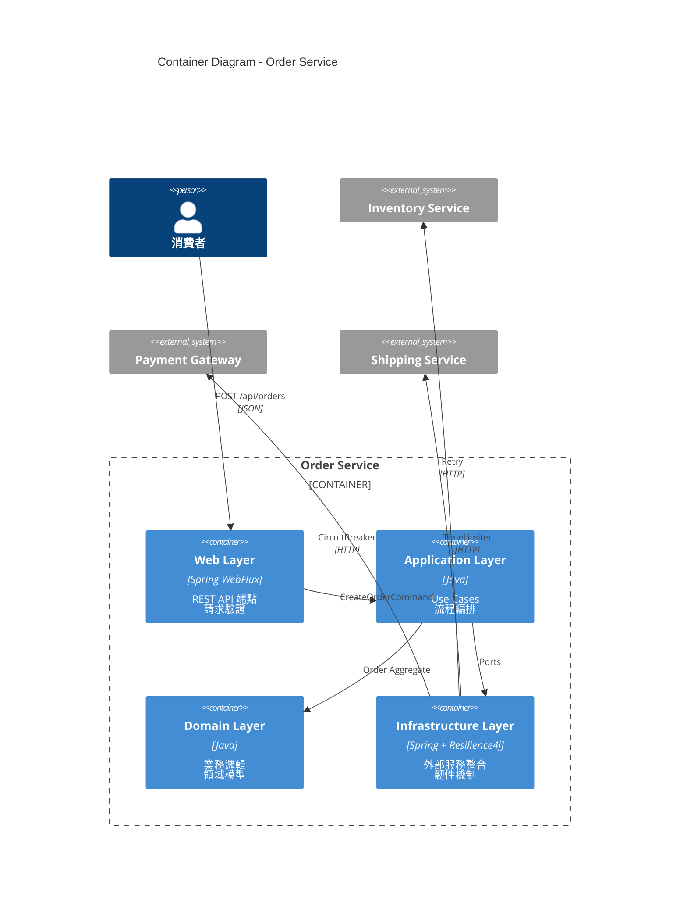

### 六角形架構 (Hexagonal Architecture)

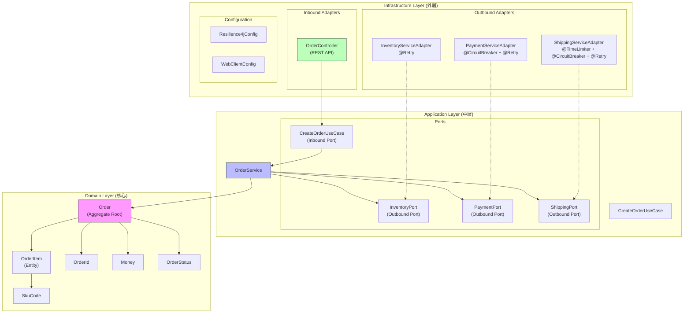

---

## 領域模型

### ER Diagram

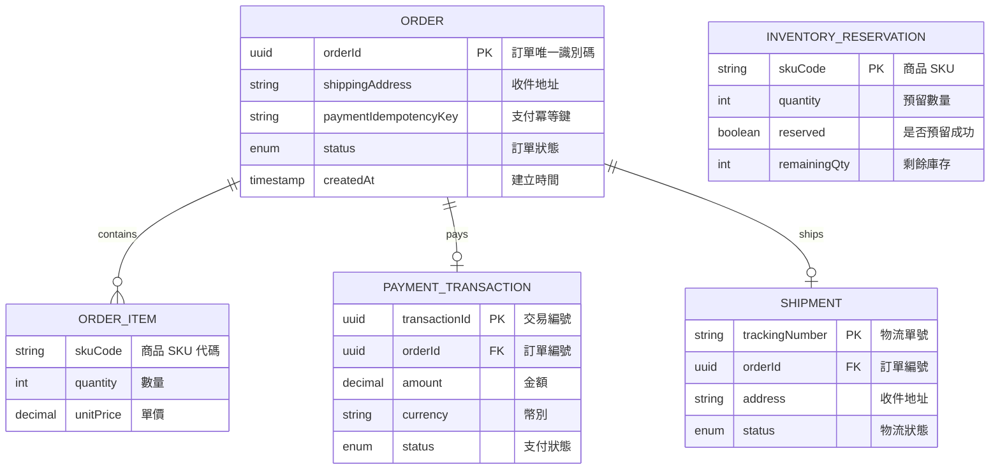

### 訂單狀態機

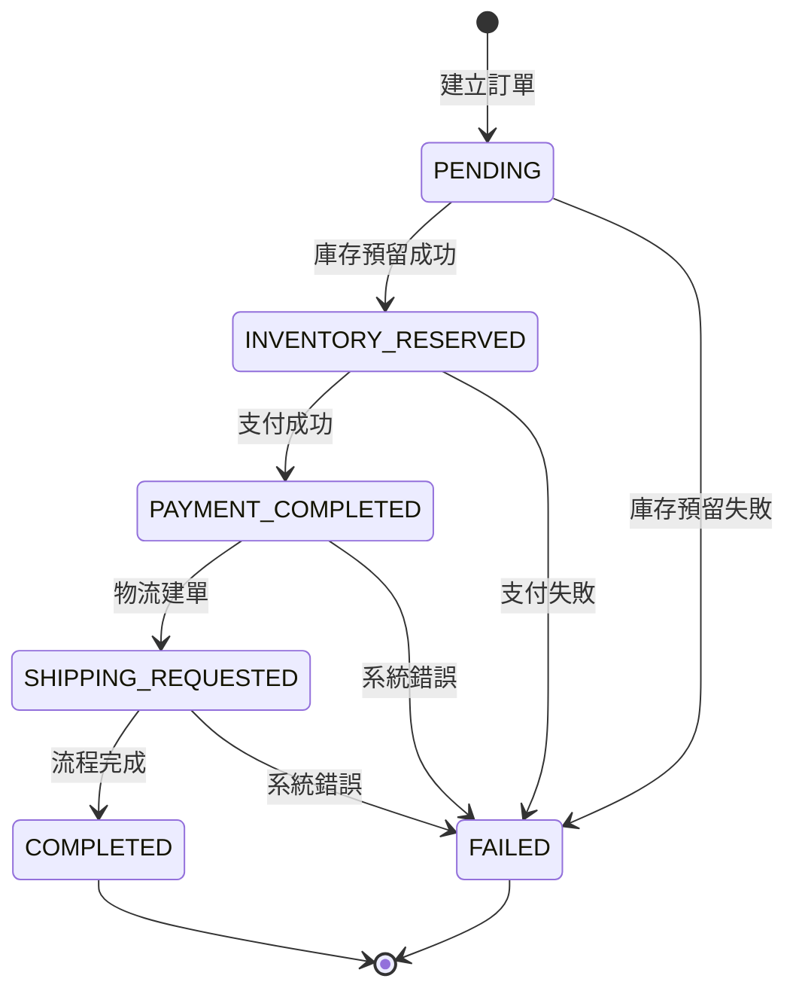

---

## 類別圖

### Domain Layer

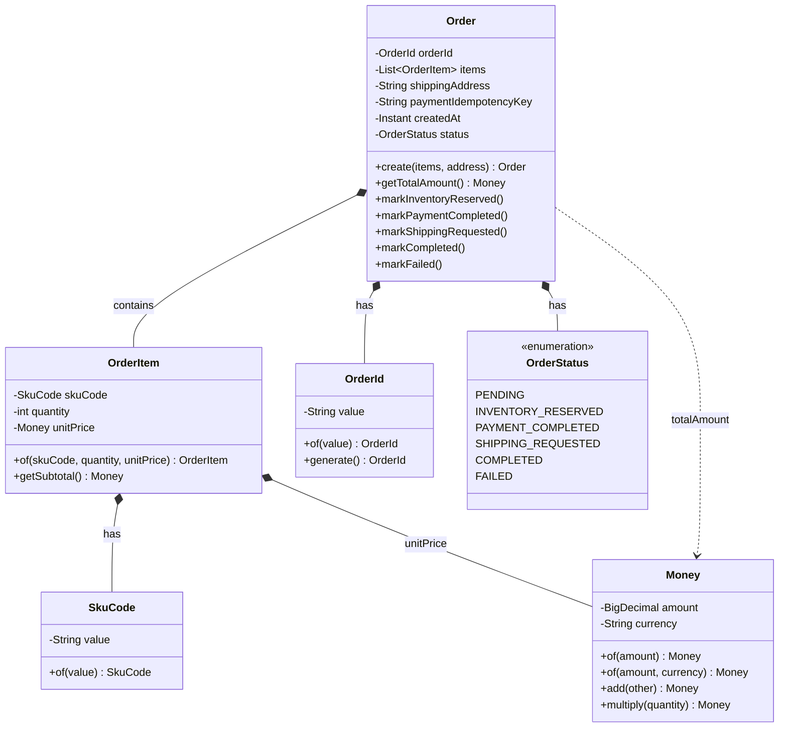

### Application Layer


### Infrastructure Layer - Adapters

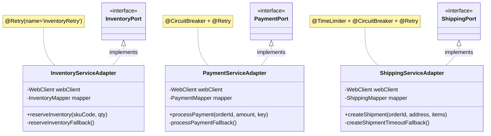

---

## 循序圖

### 正常流程

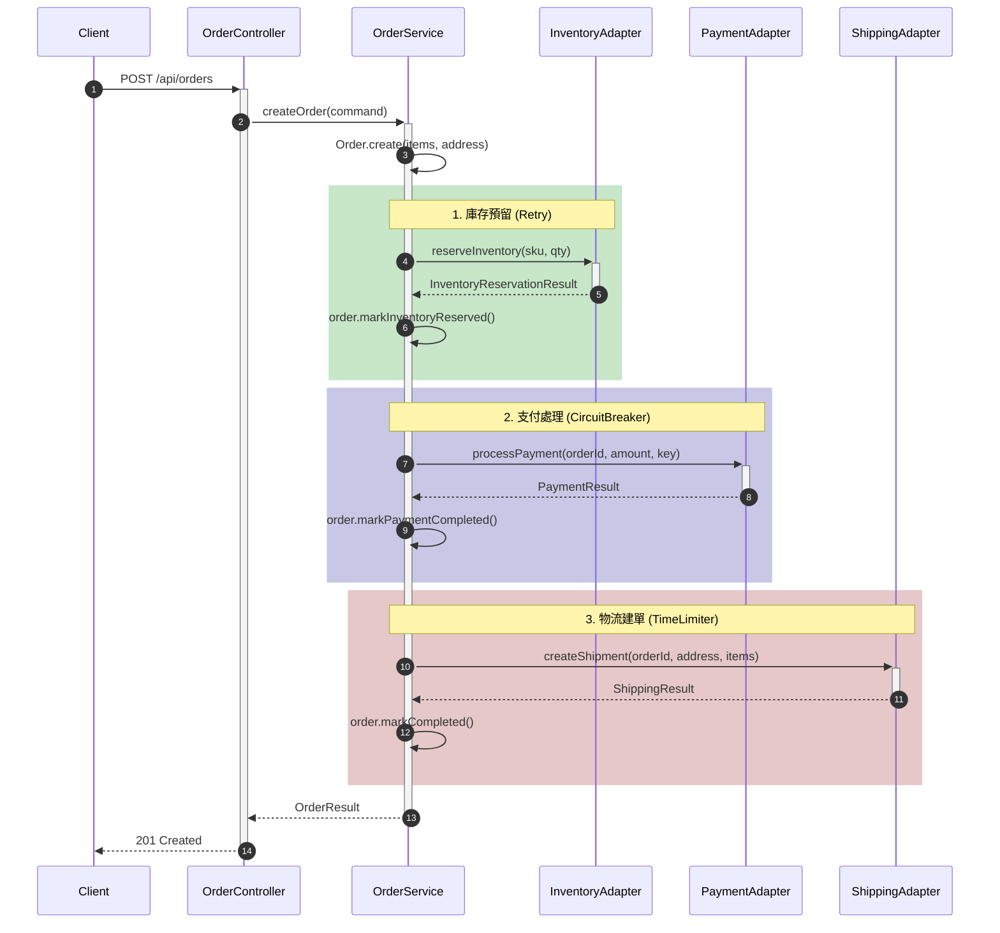

### Retry 機制 - 暫時性故障恢復

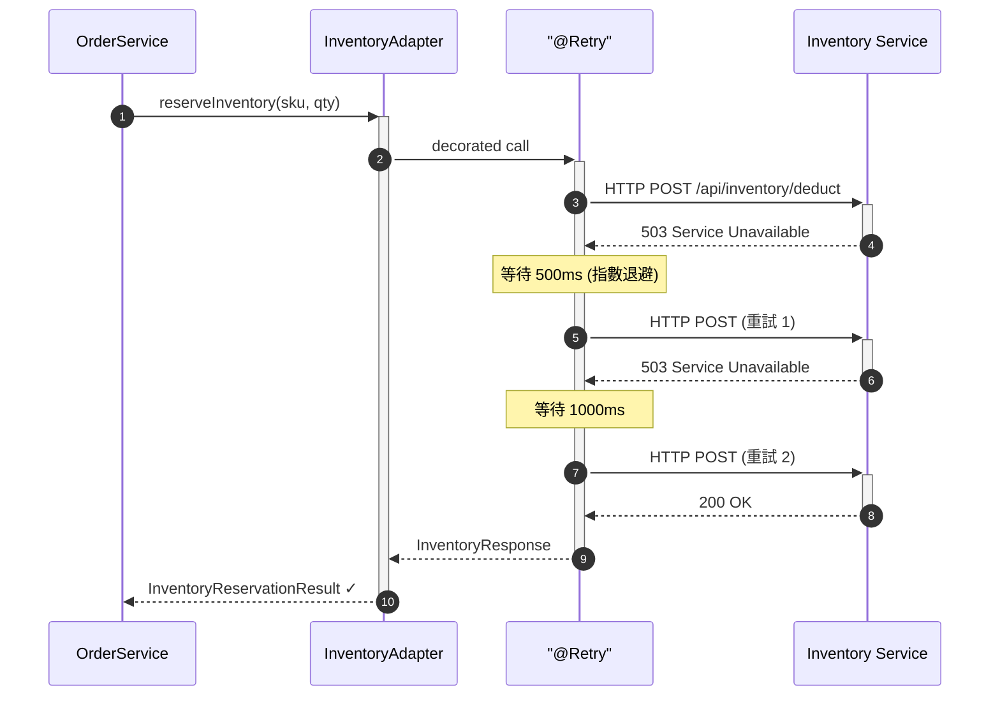

### CircuitBreaker 機制 - 快速失敗保護

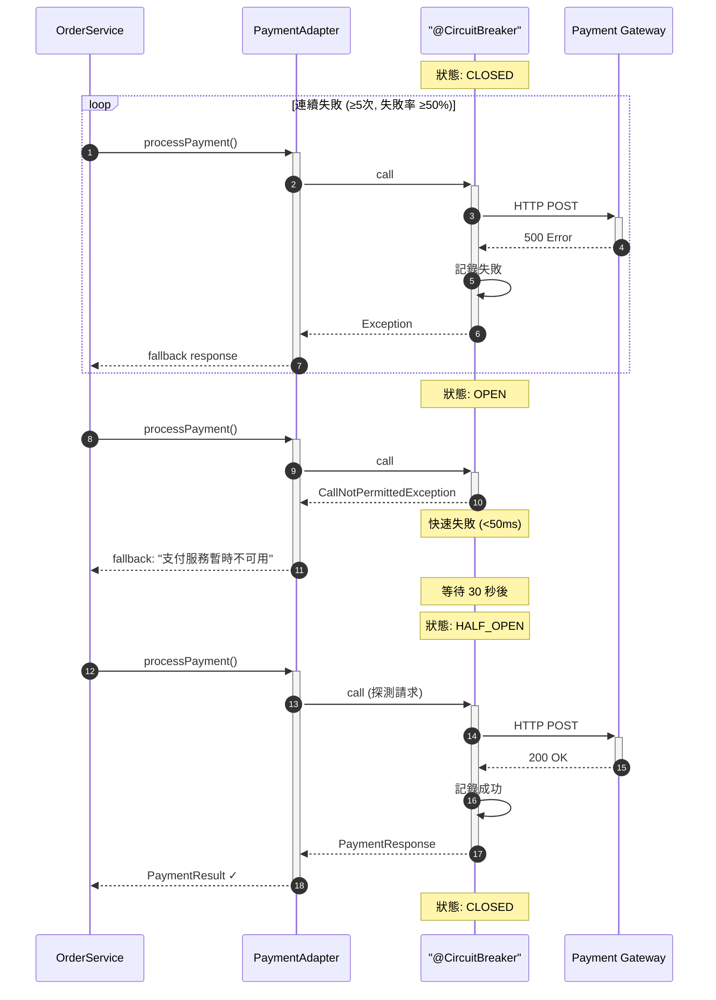

### TimeLimiter 機制 - 超時降級

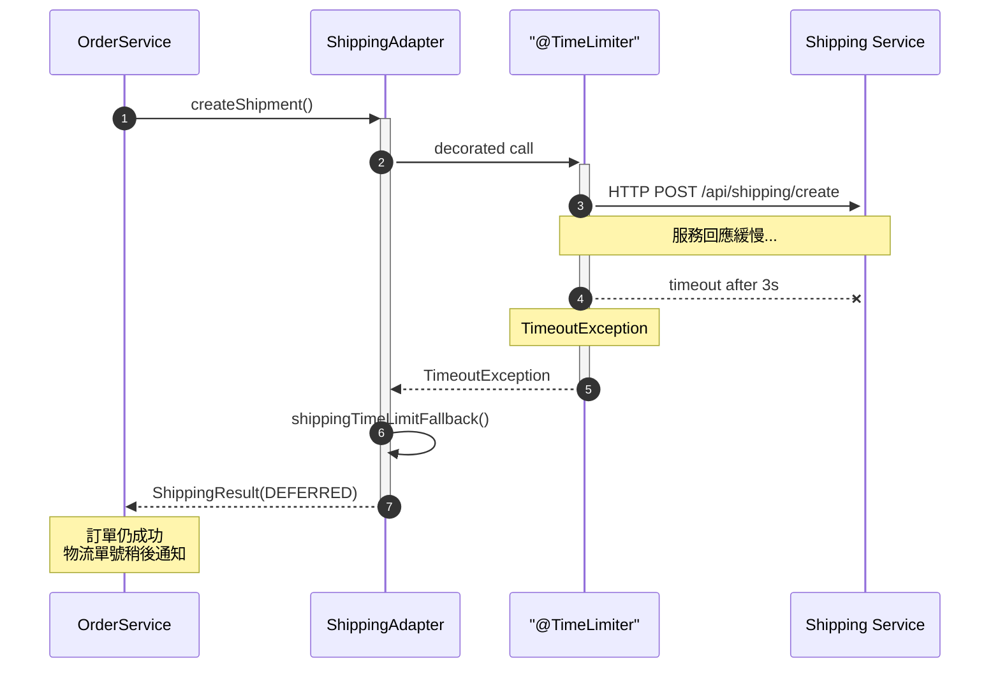

---

## API 清單

### Order API

| Method | Endpoint | Description | Request | Response |
|--------|----------|-------------|---------|----------|
| POST | `/api/orders` | 建立訂單 | CreateOrderRequest | CreateOrderResponse |

### Actuator Endpoints

| Endpoint | Description |
|----------|-------------|
| GET `/actuator/health` | 健康檢查 |
| GET `/actuator/circuitbreakers` | 斷路器狀態 |
| GET `/actuator/retries` | 重試配置 |
| GET `/actuator/timelimiters` | 超時控制配置 |
| GET `/actuator/prometheus` | Prometheus 指標 |
| GET `/actuator/metrics` | 應用程式指標 |

### Request/Response 範例

**Request:**
```json
{
  "items": [
    {
      "skuCode": "SKU001",
      "quantity": 2,
      "unitPrice": 1500.00
    }
  ],
  "shippingAddress": "台北市信義區松仁路100號"
}
```

**Response (Success):**
```json
{
  "orderId": "550e8400-e29b-41d4-a716-446655440000",
  "status": "COMPLETED",
  "totalAmount": 3000.00,
  "currency": "TWD",
  "trackingNumber": "TRK123456789",
  "message": "Order created successfully",
  "createdAt": "2026-02-02T12:00:00Z"
}
```

**Response (Deferred Shipping):**
```json
{
  "orderId": "550e8400-e29b-41d4-a716-446655440000",
  "status": "COMPLETED",
  "totalAmount": 3000.00,
  "currency": "TWD",
  "trackingNumber": null,
  "message": "Order created. Tracking number will be provided later via notification.",
  "createdAt": "2026-02-02T12:00:00Z"
}
```

---

## Resilience4j 配置

### Retry 配置

| 實例 | maxAttempts | waitDuration | backoffMultiplier | 適用場景 |
|------|-------------|--------------|-------------------|----------|
| inventoryRetry | 3 | 500ms | 2.0 | 庫存服務暫時性錯誤 |
| paymentRetry | 3 | 1000ms | 2.0 | 支付閘道暫時性錯誤 |
| shippingRetry | 2 | 500ms | - | 物流服務暫時性錯誤 |

### CircuitBreaker 配置

| 實例 | failureRateThreshold | slowCallRateThreshold | waitDurationInOpenState | 適用場景 |
|------|---------------------|----------------------|------------------------|----------|
| inventoryCB | 60% | 80% | 30s | 庫存服務保護 |
| paymentCB | 50% | 80% | 30s | 支付閘道保護（較敏感）|
| shippingCB | 60% | 80% | 30s | 物流服務保護 |

### TimeLimiter 配置

| 實例 | timeoutDuration | cancelRunningFuture | 適用場景 |
|------|-----------------|---------------------|----------|
| inventoryTL | 4s | true | 涵蓋完整重試週期 |
| paymentTL | 8s | true | 涵蓋完整重試週期 |
| shippingTL | 3s | true | 快速降級處理 |

### 裝飾器執行順序

```
TimeLimiter → CircuitBreaker → Retry → HTTP Call
```

---

## 測試案例

### 測試統計

```
Total Tests: 36
├── Unit Tests: 15
│   └── OrderTest (Domain Layer)
└── Integration Tests: 21
    ├── RetryIntegrationTest: 5
    ├── CircuitBreakerIntegrationTest: 6
    ├── TimeLimiterIntegrationTest: 5
    └── CombinedResilienceTest: 5
```

### 測試場景對照表

| 測試類別 | 測試案例 | 驗證目標 |
|----------|----------|----------|
| **RetryIntegrationTest** | | |
| | should_retry_and_succeed_on_transient_failure | 暫時性故障自動重試成功 |
| | should_not_retry_on_4xx_business_error | 4xx 錯誤不重試 |
| | should_not_retry_on_409_insufficient_stock | 庫存不足不重試 |
| | should_return_error_when_retry_exhausted | 重試耗盡返回錯誤 |
| | should_use_exponential_backoff | 指數退避策略 |
| **CircuitBreakerIntegrationTest** | | |
| | should_open_when_failure_rate_exceeds_threshold | 失敗率超標開啟斷路器 |
| | should_fast_fail_when_open | 開啟時快速失敗 (<100ms) |
| | should_return_proper_error_message | 返回適當錯誤訊息 |
| | should_transition_to_half_open | 等待後進入半開狀態 |
| | should_close_when_probe_succeeds | 探測成功時關閉 |
| | should_succeed_when_healthy | 服務正常時成功 |
| **TimeLimiterIntegrationTest** | | |
| | should_timeout_and_fallback_on_slow_response | 慢回應超時降級 |
| | should_return_deferred_message | 返回延後處理訊息 |
| | should_record_timeout_as_failure | 超時計入失敗統計 |
| | should_succeed_when_quick_response | 快速回應時成功 |
| | should_cancel_running_future | 超時時取消請求 |
| **CombinedResilienceTest** | | |
| | should_operate_independently | 各服務斷路器獨立運作 |
| | should_skip_retry_when_cb_open | 斷路器開啟跳過重試 |
| | should_preserve_idempotency_key | 冪等鍵一致性 |
| | should_handle_combined_failures | 組合故障場景 |
| | should_record_metrics | 記錄韌性事件指標 |

### 執行測試

```bash
# 執行所有測試
./gradlew test

# 執行特定測試類別
./gradlew test --tests "RetryIntegrationTest"
./gradlew test --tests "CircuitBreakerIntegrationTest"
./gradlew test --tests "TimeLimiterIntegrationTest"
./gradlew test --tests "CombinedResilienceTest"

# 執行單元測試
./gradlew test --tests "OrderTest"
```

---

## 專案結構

```
src/
├── main/java/com/example/order/
│   ├── domain/                          # 領域層 (純業務邏輯)
│   │   ├── model/
│   │   │   ├── Order.java              # 聚合根
│   │   │   ├── OrderItem.java          # 實體
│   │   │   ├── OrderId.java            # 值物件
│   │   │   ├── Money.java              # 值物件
│   │   │   ├── SkuCode.java            # 值物件
│   │   │   └── OrderStatus.java        # 列舉
│   │   └── exception/
│   │       ├── DomainException.java
│   │       └── InsufficientStockException.java
│   │
│   ├── application/                     # 應用層 (用例編排)
│   │   ├── port/
│   │   │   ├── in/
│   │   │   │   └── CreateOrderUseCase.java
│   │   │   └── out/
│   │   │       ├── InventoryPort.java
│   │   │       ├── PaymentPort.java
│   │   │       └── ShippingPort.java
│   │   ├── service/
│   │   │   └── OrderService.java
│   │   └── dto/
│   │       ├── CreateOrderCommand.java
│   │       └── OrderResult.java
│   │
│   └── infrastructure/                  # 基礎設施層 (框架整合)
│       ├── adapter/
│       │   ├── in/web/
│       │   │   ├── OrderController.java
│       │   │   ├── dto/
│       │   │   └── mapper/
│       │   └── out/
│       │       ├── inventory/
│       │       ├── payment/
│       │       └── shipping/
│       ├── config/
│       │   ├── Resilience4jEventConfig.java
│       │   ├── WebClientConfig.java
│       │   └── OpenApiConfig.java
│       └── exception/
│           ├── GlobalExceptionHandler.java
│           ├── RetryableServiceException.java
│           ├── NonRetryableServiceException.java
│           ├── BusinessException.java
│           └── ServiceUnavailableException.java
│
└── test/java/com/example/order/
    ├── integration/
    │   ├── RetryIntegrationTest.java
    │   ├── CircuitBreakerIntegrationTest.java
    │   ├── TimeLimiterIntegrationTest.java
    │   └── CombinedResilienceTest.java
    ├── unit/domain/
    │   └── OrderTest.java
    └── support/
        └── WireMockTestSupport.java
```

---

## 技術棧

| 類別 | 技術 | 版本 |
|------|------|------|
| Language | Java | 17+ |
| Framework | Spring Boot | 3.2.x |
| Reactive | Spring WebFlux | 6.1.x |
| Resilience | Resilience4j | 2.2.x |
| API Documentation | SpringDoc OpenAPI | 2.3.x |
| Metrics | Micrometer + Prometheus | 1.12.x |
| Testing | JUnit 5 + WireMock | 5.10 / 3.3.x |
| Build | Gradle | 8.5 |

---

## 學習資源

### 相關概念

- [Hexagonal Architecture](https://alistair.cockburn.us/hexagonal-architecture/)
- [Domain-Driven Design](https://martinfowler.com/bliki/DomainDrivenDesign.html)
- [Circuit Breaker Pattern](https://martinfowler.com/bliki/CircuitBreaker.html)
- [Retry Pattern](https://docs.microsoft.com/en-us/azure/architecture/patterns/retry)

### Resilience4j 文件

- [Resilience4j Documentation](https://resilience4j.readme.io/)
- [Resilience4j with Spring Boot](https://resilience4j.readme.io/docs/getting-started-3)

### Spring Boot

- [Spring WebFlux](https://docs.spring.io/spring-framework/reference/web/webflux.html)
- [Spring Boot Actuator](https://docs.spring.io/spring-boot/docs/current/reference/html/actuator.html)

---

## License

Apache 2.0
