# Resilience4j PoC - 電子商務訂單服務韌性機制

[](./gradlew)
[](https://openjdk.org/)
[](https://spring.io/projects/spring-boot)
[](https://resilience4j.readme.io/)

---

## 目錄

### 概述
- [專案目的](#專案目的)
- [為什麼需要這些設計？](#為什麼需要這些設計) ⭐ 必讀
- [專案狀態](#專案狀態)

### 快速入門
- [快速開始](#快速開始)
- [測試 API](#測試-api)

### 架構設計
- [系統架構](#系統架構)
  - [C4 Model - System Context](#c4-model---system-context)
  - [C4 Model - Container Diagram](#c4-model---container-diagram)
  - [六角形架構](#六角形架構-hexagonal-architecture)
- [領域模型](#領域模型)
  - [ER Diagram](#er-diagram)
  - [訂單狀態機](#訂單狀態機)
- [類別圖](#類別圖)
- [循序圖](#循序圖)

### In-flight 請求保護
- [In-flight 請求保護機制](#in-flight-請求保護機制)
  - [策略 1: Graceful Shutdown](#策略-1-graceful-shutdown優雅關閉)
  - [策略 2: Idempotency](#策略-2-idempotency冪等性)
  - [策略 3: Outbox Pattern + Saga](#策略-3-outbox-pattern--saga)

### API 與配置
- [API 清單](#api-清單)
- [Resilience4j 配置](#resilience4j-配置)
- [In-flight 保護配置](#in-flight-保護配置)

### 測試
- [測試案例](#測試案例)
- [測試場景對照表](#測試場景對照表)

### 深入學習
- [設計原理與教學](#設計原理與教學) ⭐ 技術深度
  - [1. 分散式系統的故障類型](#1-分散式系統的故障類型)
  - [2. 韌性模式的設計原則](#2-韌性模式的設計原則)
  - [3. In-flight 請求問題深入解析](#3-in-flight-請求問題深入解析)
  - [4. Graceful Shutdown 設計原理](#4-graceful-shutdown-設計原理)
  - [5. Idempotency 設計原理](#5-idempotency冪等性設計原理)
  - [6. Outbox Pattern 設計原理](#6-outbox-pattern-設計原理)
  - [7. 三種策略的協作](#7-三種策略的協作)
  - [8. 最佳實踐與常見陷阱](#8-最佳實踐與常見陷阱)
  - [9. 監控與告警建議](#9-監控與告警建議)

### 參考資料
- [專案結構](#專案結構)
- [技術棧](#技術棧)
- [學習資源](#學習資源)

---

## 專案目的

本專案是一個 **Resilience4j 韌性機制概念驗證 (PoC)**，展示如何在微服務架構中實現服務韌性。透過模擬電子商務訂單服務，示範三種核心韌性模式：

| 模式 | 目的 | 應用場景 |
|------|------|----------|
| **Retry（重試）** | 處理暫時性故障 | 庫存服務網路抖動 |
| **CircuitBreaker（斷路器）** | 防止雪崩效應 | 支付閘道持續故障 |
| **TimeLimiter（超時控制）** | 保護資源不被阻塞 | 物流服務慢回應 |

此外，本專案還實作了 **In-flight 請求保護機制**，確保 K8s Pod 損毀時請求不遺失：

| 策略 | 目的 | 實作方式 |
|------|------|----------|
| **Graceful Shutdown** | 計畫性重啟不丟請求 | 等待進行中請求完成 |
| **Idempotency** | Client 安全重試 | 冪等鍵 + 結果快取 |
| **Outbox Pattern** | 交易一致性保證 | 單一交易寫入 DB + Outbox |

---

## 為什麼需要這些設計？

在深入技術細節之前，讓我們先了解：**為什麼微服務架構需要韌性設計？**

### 真實世界的故障案例

**電商大促期間的典型故障場景** - 場景：雙 11 大促，訂單量是平日的 50 倍

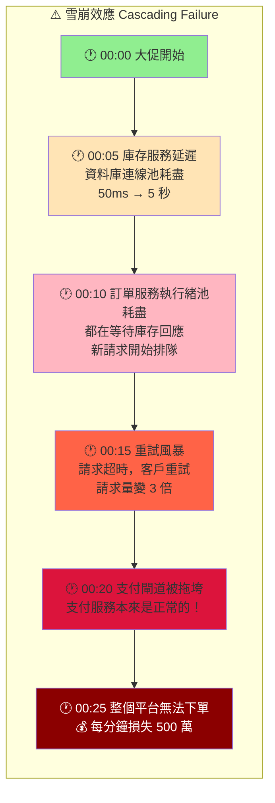

### 沒有韌性設計會怎樣？

| 問題 | 沒有保護機制 | 業務影響 |
|------|-------------|---------|
| **庫存服務暫時不可用** | 訂單直接失敗 | 客戶流失、營收損失 |
| **支付閘道回應慢** | 執行緒阻塞，拖垮整個服務 | 全站無法下單 |
| **物流服務超時** | 訂單建立失敗 | 客戶需要重新下單 |
| **Pod 重啟時有請求進行中** | 請求遺失，資料不一致 | 客訴、人工處理成本 |
| **網路閃斷導致回應遺失** | 客戶重試造成重複訂單 | 重複扣款、退款處理 |

### 韌性設計如何解決這些問題？

#### 問題 1: 庫存服務網路抖動（暫時性故障）

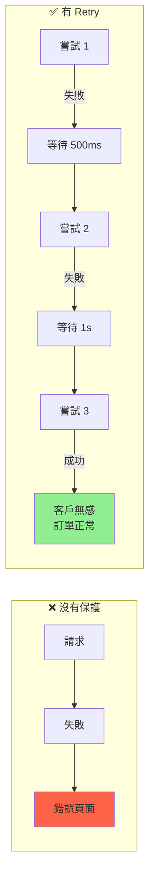

#### 問題 2: 支付閘道持續故障（持續性故障）

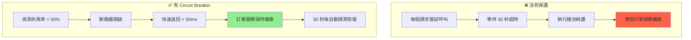

#### 問題 3: 物流服務回應慢（慢回應）

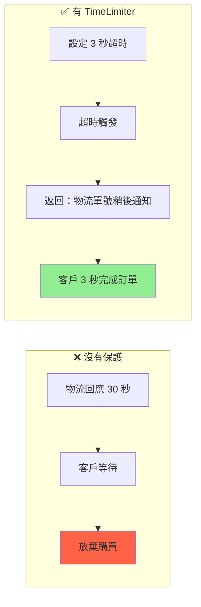

#### 問題 4: K8s Rolling Update 時有請求進行中

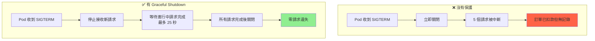

#### 問題 5: 網路閃斷，客戶重試

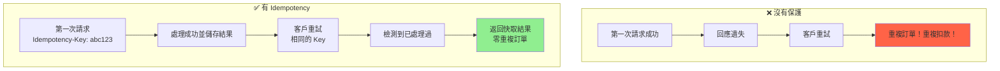

#### 問題 6: 應用程式在呼叫外部服務後當機

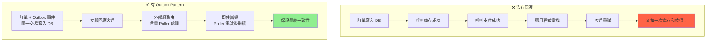

### 成本效益分析

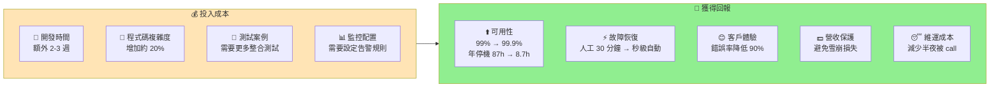

> **結論：對於關鍵業務服務，韌性設計的 ROI 非常高**

### 什麼時候需要這些設計？

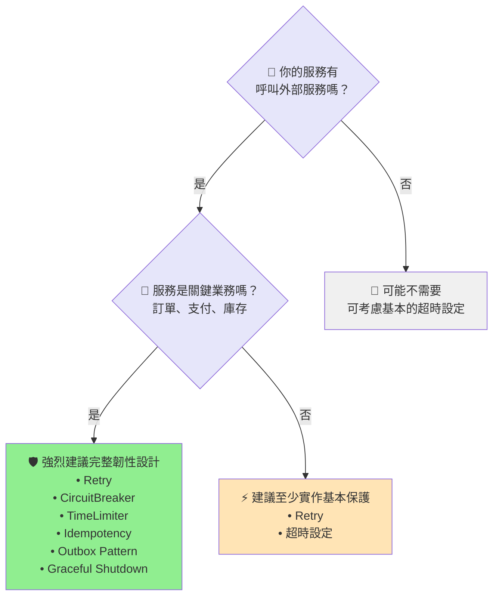

**本專案的訂單服務分析：**

| 條件 | 評估結果 |
|------|---------|
| 呼叫外部服務 | ✅ 3 個（庫存、支付、物流） |
| 核心業務 | ✅ 直接影響營收 |
| 運行環境 | ✅ K8s（會有 Rolling Update） |
| **結論** | **需要完整的韌性設計** ✓ |

### 韌性設計的核心原則

| 原則 | 說明 | 本專案實作 |
|------|------|-----------|
| **Fail Fast** | 快速失敗比慢慢失敗好 | Circuit Breaker 開啟時 < 50ms 返回 |
| **Graceful Degradation** | 降級比完全失敗好 | 物流超時時返回「稍後通知」 |
| **Bulkhead Isolation** | 隔離故障，避免擴散 | 每個服務獨立的斷路器 |
| **Retry with Backoff** | 重試要有節制 | 指數退避 + 最大重試次數 |
| **Idempotency** | 重試要安全 | Idempotency Key 機制 |
| **Eventual Consistency** | 接受最終一致性 | Outbox Pattern + Saga |

---

## 專案狀態

| 階段 | 狀態 | 說明 |
|------|------|------|
| 規格設計 | ✅ 完成 | spec.md, plan.md, tasks.md |
| Domain Layer | ✅ 完成 | Order, OrderItem, Value Objects |
| Application Layer | ✅ 完成 | Ports, Use Cases, OrderService |
| Infrastructure Layer | ✅ 完成 | Adapters, Resilience4j 配置 |
| In-flight 保護機制 | ✅ 完成 | Graceful Shutdown, Idempotency, Outbox Pattern |
| 單元測試 | ✅ 完成 | 37+ 項測試全數通過 |
| API 文件 | ✅ 完成 | Swagger UI |

---

## 快速開始

### 環境需求

- Java 17+
- Gradle 8.x

### 建置與執行

```bash
# 建置專案
./gradlew build

# 執行測試
./gradlew test

# 啟動服務
./gradlew bootRun
```

### 存取服務

| 端點 | URL |
|------|-----|
| Swagger UI | http://localhost:8080/swagger-ui.html |
| API Docs | http://localhost:8080/api-docs |
| Health Check | http://localhost:8080/actuator/health |
| Prometheus Metrics | http://localhost:8080/actuator/prometheus |

### 測試 API

```bash
curl -X POST http://localhost:8080/api/orders \
  -H "Content-Type: application/json" \
  -d '{
    "items": [
      {"skuCode": "SKU001", "quantity": 2, "unitPrice": 1500.00}
    ],
    "shippingAddress": "台北市信義區松仁路100號"
  }'
```

---

## 系統架構

### C4 Model - System Context

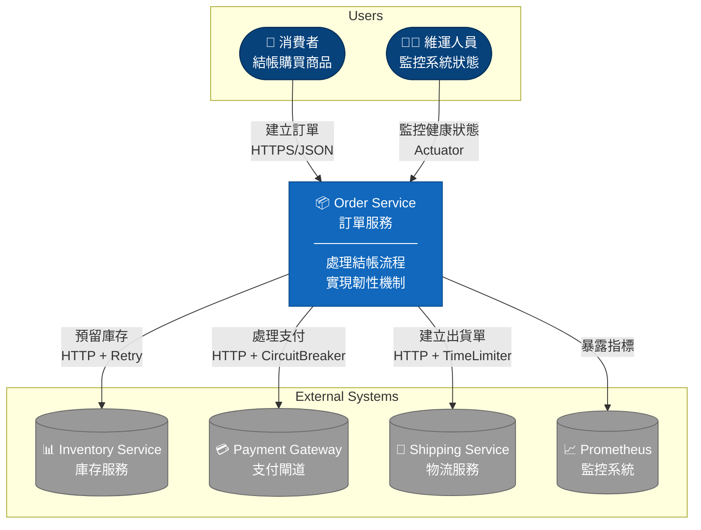

### C4 Model - Container Diagram

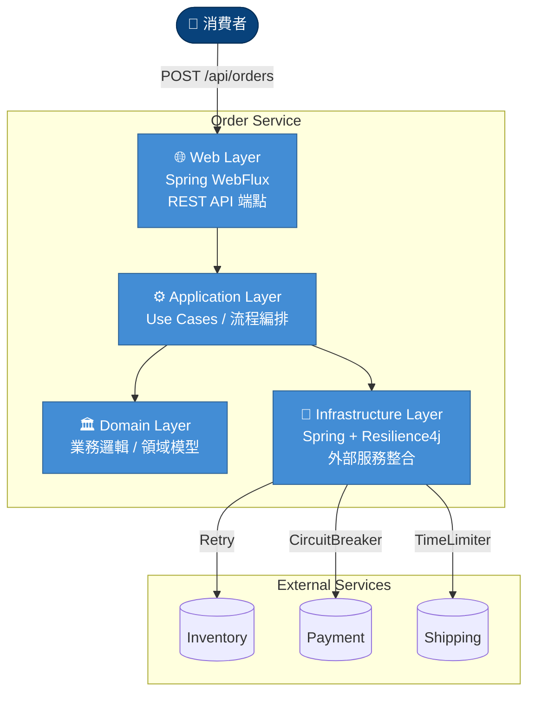

### 六角形架構 (Hexagonal Architecture)

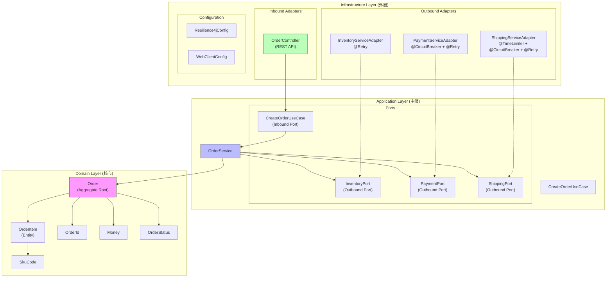

---

## 領域模型

### ER Diagram

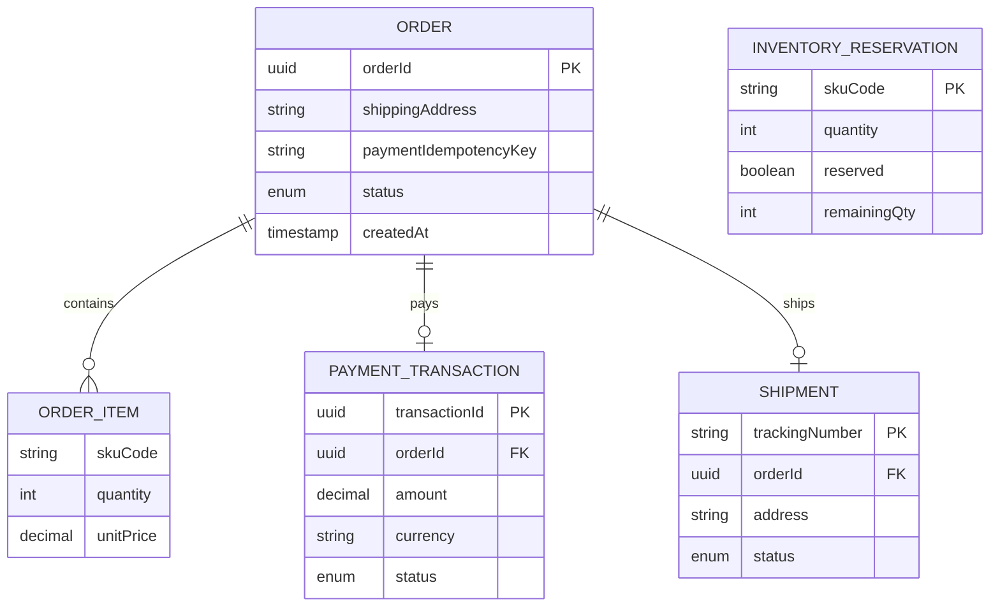

**欄位說明：**

| 表格 | 欄位 | 說明 |
|------|------|------|
| **ORDER** | orderId | 訂單唯一識別碼 |
| | shippingAddress | 收件地址 |
| | paymentIdempotencyKey | 支付冪等鍵 |
| | status | 訂單狀態 |
| | createdAt | 建立時間 |
| **ORDER_ITEM** | skuCode | 商品 SKU 代碼 |
| | quantity | 數量 |
| | unitPrice | 單價 |
| **PAYMENT_TRANSACTION** | transactionId | 交易編號 |
| | orderId | 訂單編號 (FK) |
| | amount | 金額 |
| | currency | 幣別 |
| | status | 支付狀態 |
| **SHIPMENT** | trackingNumber | 物流單號 |
| | orderId | 訂單編號 (FK) |
| | address | 收件地址 |
| | status | 物流狀態 |

### 訂單狀態機

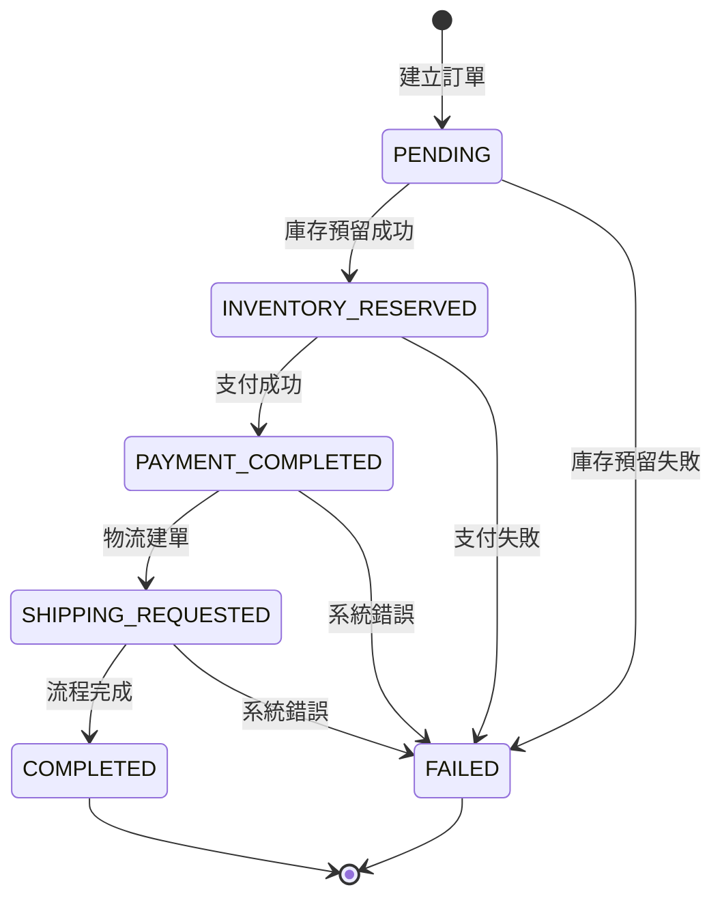

---

## In-flight 請求保護機制

本專案實作了三種策略來確保 K8s Pod 損毀時請求不遺失：

### 策略 1: Graceful Shutdown（優雅關閉）

處理計畫性重啟（如 Rolling Update）時的請求保護。

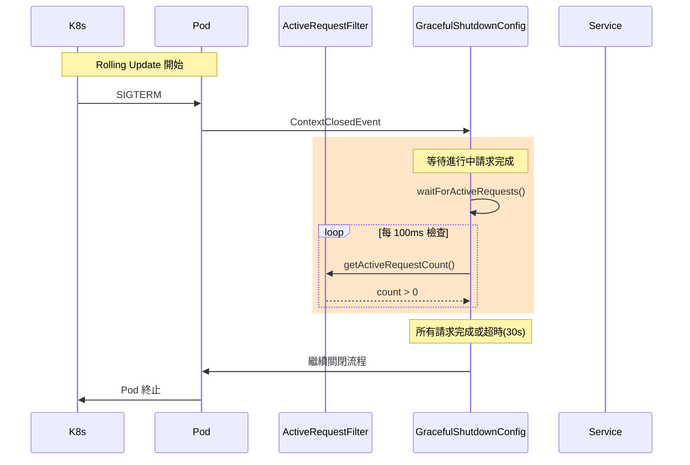

**核心元件：**
- `ActiveRequestFilter`: WebFilter 追蹤所有進行中的 HTTP 請求
- `GracefulShutdownConfig`: 監聽關閉事件，等待請求完成

### 策略 2: Idempotency（冪等性）

確保 Client 可以安全重試，不會造成重複處理。

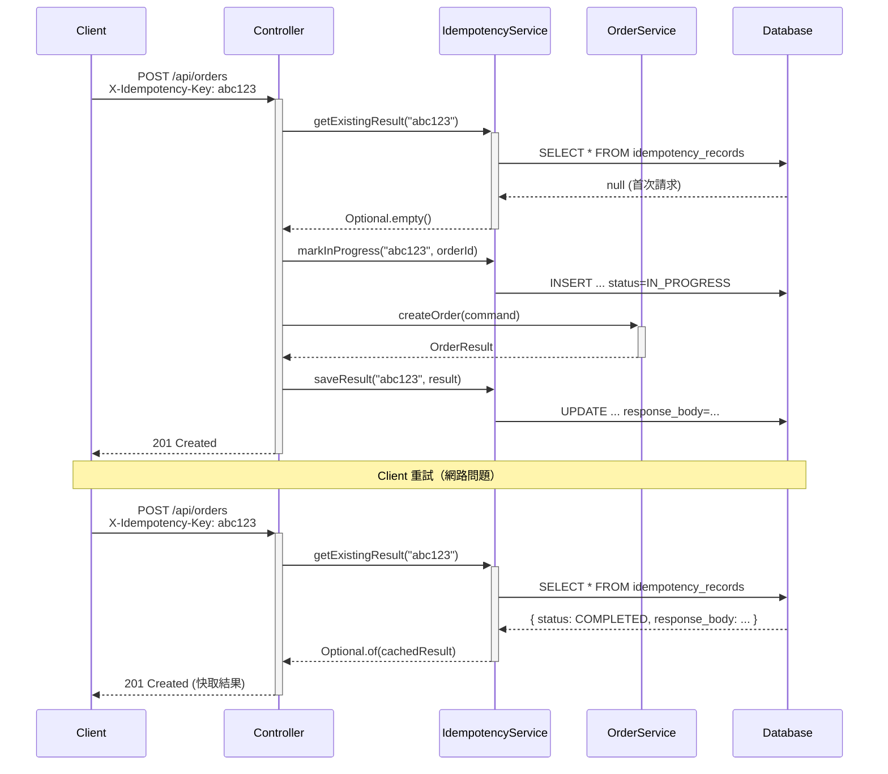

**核心元件：**
- `IdempotencyService`: 管理冪等性紀錄的查詢與儲存
- `IdempotencyRecord`: JPA Entity 儲存請求結果

### 策略 3: Outbox Pattern + Saga

確保訂單與事件在同一交易中寫入，實現最終一致性。

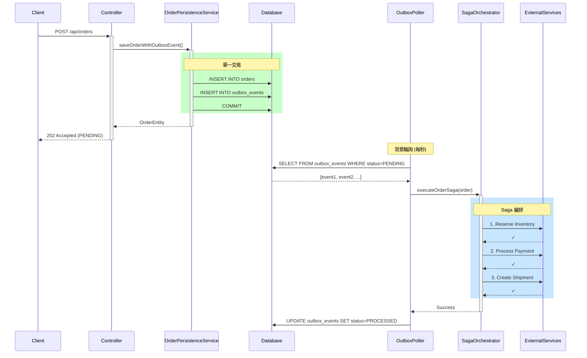

**核心元件：**
- `OrderPersistenceService`: 單一交易寫入訂單與 Outbox 事件
- `OutboxPoller`: 背景輪詢處理待處理事件
- `SagaOrchestrator`: 編排分散式交易步驟與補償

### Saga 補償機制

當 Saga 步驟失敗時，自動執行補償操作：

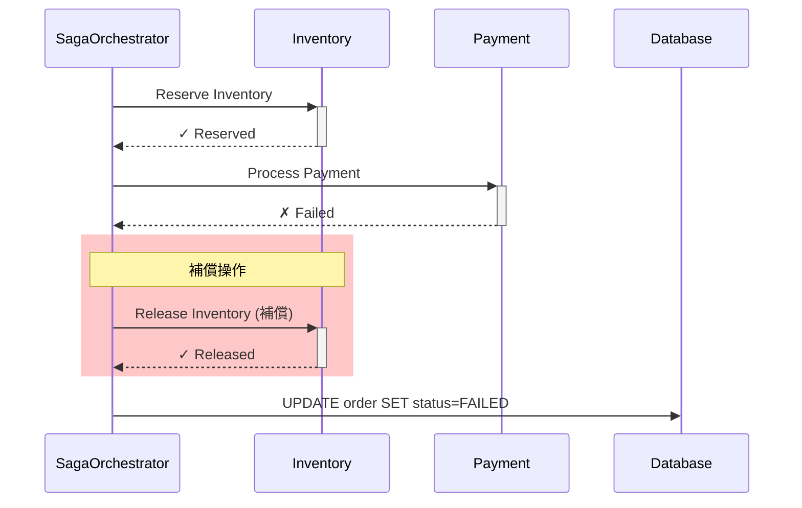

---

## 類別圖

### Domain Layer

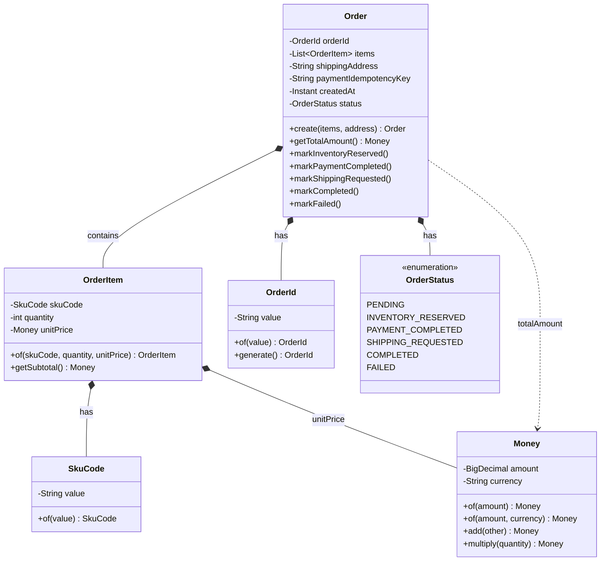

### Application Layer


### Infrastructure Layer - Adapters

```mermaid
classDiagram
    class InventoryServiceAdapter {
        -WebClient webClient
        -InventoryMapper mapper
        +reserveInventory(skuCode, qty)
        -reserveInventoryFallback()
    }

    class PaymentServiceAdapter {
        -WebClient webClient
        -PaymentMapper mapper
        +processPayment(orderId, amount, key)
        -processPaymentFallback()
    }

    class ShippingServiceAdapter {
        -WebClient webClient
        -ShippingMapper mapper
        +createShipment(orderId, address, items)
        -createShipmentTimeoutFallback()
    }

    class InventoryPort {
        <<interface>>
    }

    class PaymentPort {
        <<interface>>
    }

    class ShippingPort {
        <<interface>>
    }

    InventoryPort <|.. InventoryServiceAdapter : implements
    PaymentPort <|.. PaymentServiceAdapter : implements
    ShippingPort <|.. ShippingServiceAdapter : implements

    note for InventoryServiceAdapter "@Retry(name='inventoryRetry')"
    note for PaymentServiceAdapter "@CircuitBreaker + @Retry"
    note for ShippingServiceAdapter "@TimeLimiter + @CircuitBreaker + @Retry"
```

---

## 循序圖

### 正常流程

```mermaid
sequenceDiagram
    autonumber
    participant Client
    participant Controller as OrderController
    participant Service as OrderService
    participant Inventory as InventoryAdapter
    participant Payment as PaymentAdapter
    participant Shipping as ShippingAdapter

    Client->>+Controller: POST /api/orders
    Controller->>+Service: createOrder(command)

    Service->>Service: Order.create(items, address)

    rect rgb(200, 230, 200)
        Note over Service,Inventory: 1. 庫存預留 (Retry)
        Service->>+Inventory: reserveInventory(sku, qty)
        Inventory-->>-Service: InventoryReservationResult
        Service->>Service: order.markInventoryReserved()
    end

    rect rgb(200, 200, 230)
        Note over Service,Payment: 2. 支付處理 (CircuitBreaker)
        Service->>+Payment: processPayment(orderId, amount, key)
        Payment-->>-Service: PaymentResult
        Service->>Service: order.markPaymentCompleted()
    end

    rect rgb(230, 200, 200)
        Note over Service,Shipping: 3. 物流建單 (TimeLimiter)
        Service->>+Shipping: createShipment(orderId, address, items)
        Shipping-->>-Service: ShippingResult
        Service->>Service: order.markCompleted()
    end

    Service-->>-Controller: OrderResult
    Controller-->>-Client: 201 Created
```

### Retry 機制 - 暫時性故障恢復

```mermaid
sequenceDiagram
    autonumber
    participant Service as OrderService
    participant Adapter as InventoryAdapter
    participant R4J as "@Retry"
    participant External as Inventory Service

    Service->>+Adapter: reserveInventory(sku, qty)
    Adapter->>+R4J: decorated call

    R4J->>+External: HTTP POST /api/inventory/deduct
    External-->>-R4J: 503 Service Unavailable

    Note over R4J: 等待 500ms (指數退避)

    R4J->>+External: HTTP POST (重試 1)
    External-->>-R4J: 503 Service Unavailable

    Note over R4J: 等待 1000ms

    R4J->>+External: HTTP POST (重試 2)
    External-->>-R4J: 200 OK

    R4J-->>-Adapter: InventoryResponse
    Adapter-->>-Service: InventoryReservationResult ✓
```

### CircuitBreaker 機制 - 快速失敗保護

```mermaid
sequenceDiagram
    autonumber
    participant Service as OrderService
    participant Adapter as PaymentAdapter
    participant CB as "@CircuitBreaker"
    participant External as Payment Gateway

    Note over CB: 狀態: CLOSED

    loop 連續失敗 (≥5次, 失敗率 ≥50%)
        Service->>+Adapter: processPayment()
        Adapter->>+CB: call
        CB->>+External: HTTP POST
        External-->>-CB: 500 Error
        CB->>CB: 記錄失敗
        CB-->>-Adapter: Exception
        Adapter-->>-Service: fallback response
    end

    Note over CB: 狀態: OPEN

    Service->>+Adapter: processPayment()
    Adapter->>+CB: call
    CB-->>-Adapter: CallNotPermittedException
    Note over CB: 快速失敗 (<50ms)
    Adapter-->>-Service: fallback: "支付服務暫時不可用"

    Note over CB: 等待 30 秒後

    Note over CB: 狀態: HALF_OPEN

    Service->>+Adapter: processPayment()
    Adapter->>+CB: call (探測請求)
    CB->>+External: HTTP POST
    External-->>-CB: 200 OK
    CB->>CB: 記錄成功
    CB-->>-Adapter: PaymentResponse
    Adapter-->>-Service: PaymentResult ✓

    Note over CB: 狀態: CLOSED
```

### TimeLimiter 機制 - 超時降級

```mermaid
sequenceDiagram
    autonumber
    participant Service as OrderService
    participant Adapter as ShippingAdapter
    participant TL as "@TimeLimiter"
    participant External as Shipping Service

    Service->>+Adapter: createShipment()
    Adapter->>+TL: decorated call
    TL->>+External: HTTP POST /api/shipping/create

    Note over TL,External: 服務回應緩慢...

    TL--xExternal: timeout after 3s
    Note over TL: TimeoutException

    TL-->>-Adapter: TimeoutException
    Adapter->>Adapter: shippingTimeLimitFallback()
    Adapter-->>-Service: ShippingResult(DEFERRED)

    Note over Service: 訂單仍成功<br/>物流單號稍後通知
```

---

## API 清單

### Order API

| Method | Endpoint | Description | Headers | Request | Response |
|--------|----------|-------------|---------|---------|----------|
| POST | `/api/orders` | 建立訂單 | X-Idempotency-Key (optional) | CreateOrderRequest | CreateOrderResponse |

### 冪等性 Header

| Header | 說明 | 範例 |
|--------|------|------|
| `X-Idempotency-Key` | 冪等鍵，用於安全重試。建議使用 UUID | `X-Idempotency-Key: 550e8400-e29b-41d4-a716-446655440000` |

**行為說明：**
- 若提供 `X-Idempotency-Key`，系統會檢查是否已處理過該請求
- 若已處理，直接返回快取的結果（不重複執行）
- 快取結果保留 24 小時
- 若未提供，每次請求都會建立新訂單

### Actuator Endpoints

| Endpoint | Description |
|----------|-------------|
| GET `/actuator/health` | 健康檢查 |
| GET `/actuator/activerequests` | 當前進行中請求數（Graceful Shutdown 用）|
| GET `/actuator/circuitbreakers` | 斷路器狀態 |
| GET `/actuator/retries` | 重試配置 |
| GET `/actuator/timelimiters` | 超時控制配置 |
| GET `/actuator/prometheus` | Prometheus 指標 |
| GET `/actuator/metrics` | 應用程式指標 |

### Request/Response 範例

**Request (同步模式):**
```bash
curl -X POST http://localhost:8080/api/orders \
  -H "Content-Type: application/json" \
  -H "X-Idempotency-Key: 550e8400-e29b-41d4-a716-446655440000" \
  -d '{
    "items": [
      {"skuCode": "SKU001", "quantity": 2, "unitPrice": 1500.00}
    ],
    "shippingAddress": "台北市信義區松仁路100號"
  }'
```

**Response (Success - 同步模式):**
```json
{
  "orderId": "550e8400-e29b-41d4-a716-446655440000",
  "status": "COMPLETED",
  "totalAmount": 3000.00,
  "currency": "TWD",
  "trackingNumber": "TRK123456789",
  "message": "Order created successfully",
  "createdAt": "2026-02-02T12:00:00Z"
}
```

**Response (Success - 非同步模式，Outbox 啟用時):**
```json
{
  "orderId": "550e8400-e29b-41d4-a716-446655440000",
  "status": "PENDING",
  "totalAmount": 3000.00,
  "currency": "TWD",
  "trackingNumber": null,
  "message": "訂單已建立，正在處理中。請稍後查詢訂單狀態。",
  "createdAt": "2026-02-02T12:00:00Z"
}
```

**Response (Deferred Shipping):**
```json
{
  "orderId": "550e8400-e29b-41d4-a716-446655440000",
  "status": "COMPLETED",
  "totalAmount": 3000.00,
  "currency": "TWD",
  "trackingNumber": null,
  "message": "Order created. Tracking number will be provided later via notification.",
  "createdAt": "2026-02-02T12:00:00Z"
}
```

**Response (冪等性 - 重複請求返回快取結果):**
```json
{
  "orderId": "550e8400-e29b-41d4-a716-446655440000",
  "status": "COMPLETED",
  "totalAmount": 3000.00,
  "currency": "TWD",
  "trackingNumber": "TRK123456789",
  "message": "Order created successfully",
  "createdAt": "2026-02-02T12:00:00Z"
}
```
*註：使用相同 `X-Idempotency-Key` 重試時，返回與首次請求相同的結果*

---

## Resilience4j 配置

### Retry 配置

| 實例 | maxAttempts | waitDuration | backoffMultiplier | 適用場景 |
|------|-------------|--------------|-------------------|----------|
| inventoryRetry | 3 | 500ms | 2.0 | 庫存服務暫時性錯誤 |
| paymentRetry | 3 | 1000ms | 2.0 | 支付閘道暫時性錯誤 |
| shippingRetry | 2 | 500ms | - | 物流服務暫時性錯誤 |

### CircuitBreaker 配置

| 實例 | failureRateThreshold | slowCallRateThreshold | waitDurationInOpenState | 適用場景 |
|------|---------------------|----------------------|------------------------|----------|
| inventoryCB | 60% | 80% | 30s | 庫存服務保護 |
| paymentCB | 50% | 80% | 30s | 支付閘道保護（較敏感）|
| shippingCB | 60% | 80% | 30s | 物流服務保護 |

### TimeLimiter 配置

| 實例 | timeoutDuration | cancelRunningFuture | 適用場景 |
|------|-----------------|---------------------|----------|
| inventoryTL | 4s | true | 涵蓋完整重試週期 |
| paymentTL | 8s | true | 涵蓋完整重試週期 |
| shippingTL | 3s | true | 快速降級處理 |

### 裝飾器執行順序

```
TimeLimiter → CircuitBreaker → Retry → HTTP Call
```

---

## In-flight 保護配置

### Graceful Shutdown 配置

```yaml
spring:
  lifecycle:
    timeout-per-shutdown-phase: 30s  # 等待進行中請求的最大時間

server:
  shutdown: graceful  # 啟用優雅關閉
```

### Outbox Pattern 配置

```yaml
outbox:
  enabled: false           # 是否啟用 Outbox Pattern (true=非同步模式)
  poller:
    enabled: true          # 是否啟用 Outbox 輪詢器
    interval-ms: 1000      # 輪詢間隔（毫秒）
    batch-size: 10         # 每次輪詢處理的事件數量
    max-retries: 3         # 事件處理最大重試次數
```

### JPA 配置

```yaml
spring:
  datasource:
    url: jdbc:postgresql://localhost:5432/orderdb
    username: postgres
    password: postgres
  jpa:
    hibernate:
      ddl-auto: create-drop  # 開發環境自動建立 Schema
    properties:
      hibernate:
        dialect: org.hibernate.dialect.PostgreSQLDialect
```

---

## 測試案例

### 測試統計

```mermaid
flowchart TB
    Total["🧪 Total Tests: 43+"]
    Unit["📦 Unit Tests: 15"]
    Integration["🔗 Integration Tests: 28+"]

    Total --> Unit
    Total --> Integration

    OrderTest["OrderTest<br/>Domain Layer"]
    Unit --> OrderTest

    Retry["RetryIntegrationTest: 5"]
    CB["CircuitBreakerIntegrationTest: 6"]
    TL["TimeLimiterIntegrationTest: 5"]
    Combined["CombinedResilienceTest: 5"]
    Idempotency["IdempotencyIntegrationTest: 4"]
    Outbox["OutboxPatternIntegrationTest: 3<br/>⚠️ 需啟用 async mode"]

    Integration --> Retry
    Integration --> CB
    Integration --> TL
    Integration --> Combined
    Integration --> Idempotency
    Integration --> Outbox

    style Total fill:#4169E1,color:#fff
    style Unit fill:#32CD32
    style Integration fill:#FF8C00
    style Outbox fill:#FFE4B5
```

### 測試環境

| 模式 | 資料庫 | 啟用方式 |
|------|--------|----------|
| 預設 | H2 In-Memory | `./gradlew test` |
| Testcontainers | PostgreSQL | `./gradlew test -Dtestcontainers.enabled=true` |
| Outbox 測試 | H2 / PostgreSQL | `./gradlew test -Doutbox.tests.enabled=true` |

### 測試場景對照表

| 測試類別 | 測試案例 | 驗證目標 |
|----------|----------|----------|
| **RetryIntegrationTest** | | |
| | should_retry_and_succeed_on_transient_failure | 暫時性故障自動重試成功 |
| | should_not_retry_on_4xx_business_error | 4xx 錯誤不重試 |
| | should_not_retry_on_409_insufficient_stock | 庫存不足不重試 |
| | should_return_error_when_retry_exhausted | 重試耗盡返回錯誤 |
| | should_use_exponential_backoff | 指數退避策略 |
| **CircuitBreakerIntegrationTest** | | |
| | should_open_when_failure_rate_exceeds_threshold | 失敗率超標開啟斷路器 |
| | should_fast_fail_when_open | 開啟時快速失敗 (<100ms) |
| | should_return_proper_error_message | 返回適當錯誤訊息 |
| | should_transition_to_half_open | 等待後進入半開狀態 |
| | should_close_when_probe_succeeds | 探測成功時關閉 |
| | should_succeed_when_healthy | 服務正常時成功 |
| **TimeLimiterIntegrationTest** | | |
| | should_timeout_and_fallback_on_slow_response | 慢回應超時降級 |
| | should_return_deferred_message | 返回延後處理訊息 |
| | should_record_timeout_as_failure | 超時計入失敗統計 |
| | should_succeed_when_quick_response | 快速回應時成功 |
| | should_cancel_running_future | 超時時取消請求 |
| **CombinedResilienceTest** | | |
| | should_operate_independently | 各服務斷路器獨立運作 |
| | should_skip_retry_when_cb_open | 斷路器開啟跳過重試 |
| | should_preserve_idempotency_key | 冪等鍵一致性 |
| | should_handle_combined_failures | 組合故障場景 |
| | should_record_metrics | 記錄韌性事件指標 |
| **IdempotencyIntegrationTest** | | |
| | should_return_cached_result_for_duplicate_request | 重複請求返回快取結果 |
| **OutboxPatternIntegrationTest** | | |
| | should_create_order_and_outbox_in_single_transaction | 訂單與 Outbox 事件同交易 |
| | should_process_outbox_events_via_saga | Saga 非同步處理 Outbox 事件 |
| | should_handle_saga_failure_with_compensation | Saga 失敗執行補償 |

### 執行測試

```bash
# 執行所有測試（使用 H2 In-Memory Database）
./gradlew test

# 執行特定測試類別
./gradlew test --tests "RetryIntegrationTest"
./gradlew test --tests "CircuitBreakerIntegrationTest"
./gradlew test --tests "TimeLimiterIntegrationTest"
./gradlew test --tests "CombinedResilienceTest"
./gradlew test --tests "IdempotencyIntegrationTest"

# 執行單元測試
./gradlew test --tests "OrderTest"

# 使用 Testcontainers (需要 Docker)
./gradlew test -Dtestcontainers.enabled=true

# 執行 Outbox Pattern 測試 (非同步模式)
./gradlew test --tests "OutboxPatternIntegrationTest" -Doutbox.tests.enabled=true
```

---

## 專案結構

```
src/
├── main/java/com/example/order/
│   ├── domain/                          # 領域層 (純業務邏輯)
│   │   ├── model/
│   │   │   ├── Order.java              # 聚合根
│   │   │   ├── OrderItem.java          # 實體
│   │   │   ├── OrderId.java            # 值物件
│   │   │   ├── Money.java              # 值物件
│   │   │   ├── SkuCode.java            # 值物件
│   │   │   └── OrderStatus.java        # 列舉
│   │   └── exception/
│   │       ├── DomainException.java
│   │       └── InsufficientStockException.java
│   │
│   ├── application/                     # 應用層 (用例編排)
│   │   ├── port/
│   │   │   ├── in/
│   │   │   │   └── CreateOrderUseCase.java
│   │   │   └── out/
│   │   │       ├── InventoryPort.java
│   │   │       ├── PaymentPort.java
│   │   │       └── ShippingPort.java
│   │   ├── service/
│   │   │   ├── OrderService.java
│   │   │   ├── IdempotencyService.java          # 冪等性服務
│   │   │   ├── OrderPersistenceService.java     # 訂單持久化 + Outbox
│   │   │   ├── OutboxPoller.java                # Outbox 輪詢器
│   │   │   └── SagaOrchestrator.java            # Saga 編排器
│   │   └── dto/
│   │       ├── CreateOrderCommand.java
│   │       └── OrderResult.java
│   │
│   └── infrastructure/                  # 基礎設施層 (框架整合)
│       ├── adapter/
│       │   ├── in/web/
│       │   │   ├── OrderController.java
│       │   │   ├── dto/
│       │   │   └── mapper/
│       │   └── out/
│       │       ├── inventory/
│       │       ├── payment/
│       │       └── shipping/
│       ├── config/
│       │   ├── Resilience4jEventConfig.java
│       │   ├── WebClientConfig.java
│       │   ├── GracefulShutdownConfig.java      # 優雅關閉配置
│       │   └── OpenApiConfig.java
│       ├── filter/
│       │   └── ActiveRequestFilter.java         # 請求追蹤 Filter
│       ├── persistence/
│       │   ├── entity/
│       │   │   ├── OrderEntity.java             # 訂單 JPA Entity
│       │   │   ├── OrderItemEntity.java         # 訂單項目 Entity
│       │   │   ├── OutboxEvent.java             # Outbox 事件 Entity
│       │   │   ├── OutboxEventStatus.java       # Outbox 狀態列舉
│       │   │   └── IdempotencyRecord.java       # 冪等性紀錄 Entity
│       │   └── repository/
│       │       ├── OrderJpaRepository.java
│       │       ├── OutboxRepository.java
│       │       └── IdempotencyRepository.java
│       └── exception/
│           ├── GlobalExceptionHandler.java
│           ├── RetryableServiceException.java
│           ├── NonRetryableServiceException.java
│           ├── BusinessException.java
│           └── ServiceUnavailableException.java
│
└── test/java/com/example/order/
    ├── integration/
    │   ├── RetryIntegrationTest.java
    │   ├── CircuitBreakerIntegrationTest.java
    │   ├── TimeLimiterIntegrationTest.java
    │   ├── CombinedResilienceTest.java
    │   ├── IdempotencyIntegrationTest.java      # 冪等性測試
    │   └── OutboxPatternIntegrationTest.java    # Outbox 模式測試
    ├── unit/domain/
    │   └── OrderTest.java
    └── support/
        ├── WireMockTestSupport.java             # H2 + WireMock 測試基類
        └── PostgresTestContainerSupport.java    # PostgreSQL Testcontainers 基類
```

---

## 技術棧

| 類別 | 技術 | 版本 |
|------|------|------|
| Language | Java | 17+ |
| Framework | Spring Boot | 3.2.x |
| Reactive | Spring WebFlux | 6.1.x |
| Resilience | Resilience4j | 2.2.x |
| Persistence | Spring Data JPA + Hibernate | 3.2.x |
| Database | PostgreSQL / H2 | 15+ / 2.x |
| API Documentation | SpringDoc OpenAPI | 2.3.x |
| Metrics | Micrometer + Prometheus | 1.12.x |
| Testing | JUnit 5 + WireMock + Testcontainers | 5.10 / 3.3.x / 1.19.x |
| Async Testing | Awaitility | 4.2.x |
| Build | Gradle | 8.5 |

---

## 設計原理與教學

本章節深入探討微服務韌性設計的核心概念，以及 In-flight 請求保護機制的設計原理。

### 1. 分散式系統的故障類型

在微服務架構中，服務間的網路呼叫面臨多種故障類型：

```mermaid
flowchart TB
    subgraph types ["分散式系統故障分類"]
        subgraph transient ["⚡ 暫時性故障<br/>Transient"]
            T1["• 網路抖動"]
            T2["• 短暫過載"]
            T3["• DNS 解析延遲"]
        end

        subgraph persistent ["🔥 持續性故障<br/>Persistent"]
            P1["• 服務當機"]
            P2["• 依賴失效"]
            P3["• 配置錯誤"]
        end

        subgraph slow ["🐢 慢回應<br/>Slow Response"]
            S1["• 資源耗盡"]
            S2["• GC 停頓"]
            S3["• 資料庫鎖競爭"]
        end
    end

    transient --> Retry["🔄 Retry"]
    persistent --> CB["⚡ Circuit Breaker"]
    slow --> TL["⏱️ Time Limiter"]

    style transient fill:#E3F2FD
    style persistent fill:#FFEBEE
    style slow fill:#FFF3E0
    style Retry fill:#C8E6C9
    style CB fill:#C8E6C9
    style TL fill:#C8E6C9
```

#### 1.1 暫時性故障 (Transient Failures)

**特徵**：故障是短暫的，通常在幾毫秒到幾秒內自行恢復。

**常見原因**：
- 網路封包遺失或延遲
- 負載均衡器切換
- 容器重啟瞬間
- DNS 快取更新

**解決策略**：**Retry（重試）**
- 自動重試可以克服大部分暫時性故障
- 配合指數退避避免加劇問題

```java
// 本專案的 Retry 實作 - InventoryServiceAdapter.java
@Retry(name = "inventoryRetry", fallbackMethod = "reserveInventoryFallback")
public CompletableFuture<InventoryReservationResult> reserveInventory(
        SkuCode skuCode, int quantity) {
    // 當發生 5xx 錯誤時，Resilience4j 會自動重試
    return webClient.post()
            .uri("/api/inventory/reserve")
            .bodyValue(new InventoryRequest(skuCode.value(), quantity))
            .retrieve()
            .bodyToMono(InventoryResponse.class)
            .map(mapper::toResult)
            .toFuture();
}
```

#### 1.2 持續性故障 (Persistent Failures)

**特徵**：故障會持續一段時間，重試無法解決。

**常見原因**：
- 下游服務完全不可用
- 資料庫連線池耗盡
- 配置錯誤導致的失敗
- 第三方 API 配額用盡

**解決策略**：**Circuit Breaker（斷路器）**
- 快速失敗，避免資源浪費
- 防止雪崩效應
- 給予下游服務恢復時間

```java
// 本專案的 CircuitBreaker 實作 - PaymentServiceAdapter.java
@CircuitBreaker(name = "paymentCircuitBreaker", fallbackMethod = "processPaymentFallback")
@Retry(name = "paymentRetry")
public CompletableFuture<PaymentResult> processPayment(
        OrderId orderId, Money amount, String idempotencyKey) {
    // 當失敗率超過 50% 時，斷路器開啟
    // 開啟後的請求會直接進入 fallback，不會呼叫下游服務
    return webClient.post()
            .uri("/api/payments/process")
            .bodyValue(new PaymentRequest(...))
            .retrieve()
            .bodyToMono(PaymentResponse.class)
            .map(mapper::toResult)
            .toFuture();
}
```

#### 1.3 慢回應 (Slow Responses)

**特徵**：服務有回應但延遲過高，佔用呼叫端資源。

**常見原因**：
- 下游服務過載
- 複雜查詢導致慢回應
- 網路擁塞
- 資源競爭（CPU、I/O）

**解決策略**：**Time Limiter（超時控制）**
- 設定合理的超時時間
- 超時後執行降級邏輯
- 釋放執行緒資源

```java
// 本專案的 TimeLimiter 實作 - ShippingServiceAdapter.java
@TimeLimiter(name = "shippingTimeLimiter", fallbackMethod = "createShipmentTimeoutFallback")
@CircuitBreaker(name = "shippingCircuitBreaker")
@Retry(name = "shippingRetry")
public CompletableFuture<ShippingResult> createShipment(
        OrderId orderId, String address, List<OrderItem> items) {
    // 超過 3 秒未回應，觸發超時 fallback
    // 訂單仍成功，物流單號稍後通知
    return webClient.post()
            .uri("/api/shipping/create")
            .bodyValue(new ShippingRequest(...))
            .retrieve()
            .bodyToMono(ShippingResponse.class)
            .map(mapper::toResult)
            .toFuture();
}

// 超時降級 - 訂單不因物流延遲而失敗
private CompletableFuture<ShippingResult> createShipmentTimeoutFallback(
        OrderId orderId, String address, List<OrderItem> items, TimeoutException e) {
    log.warn("Shipping service timeout for order: {}", orderId.value());
    return CompletableFuture.completedFuture(
            ShippingResult.deferred("物流單號稍後通知"));
}
```

---

### 2. 韌性模式的設計原則

#### 2.1 Retry 模式深入解析

**核心問題**：如何在不加劇系統壓力的情況下，透過重試克服暫時性故障？

```mermaid
flowchart TD
    A([請求開始]) --> B{執行請求}
    B -->|成功| C([返回結果])
    B -->|失敗| D{是否為可重試錯誤?<br/>5xx, Timeout}

    D -->|否 4xx| E([直接失敗])
    D -->|是| F{重試次數 < 3?}

    F -->|否| G([執行 Fallback])
    F -->|是| H[等待退避<br/>指數退避]
    H --> B

    style A fill:#e1f5fe
    style C fill:#c8e6c9
    style E fill:#ffcdd2
    style G fill:#fff3e0
```

**關鍵設計決策**：

1. **哪些錯誤應該重試？**
   - ✅ 應重試：5xx 伺服器錯誤、網路超時、連線被拒
   - ❌ 不應重試：4xx 客戶端錯誤、業務邏輯錯誤（如庫存不足）

```java
// application.yml 中的重試配置
resilience4j.retry:
  instances:
    inventoryRetry:
      maxAttempts: 3                    # 最多重試 3 次
      waitDuration: 500ms               # 初始等待 500ms
      enableExponentialBackoff: true    # 啟用指數退避
      exponentialBackoffMultiplier: 2   # 退避倍數
      retryExceptions:                  # 只重試這些例外
        - java.net.ConnectException
        - java.net.SocketTimeoutException
        - com.example.order.infrastructure.exception.RetryableServiceException
      ignoreExceptions:                 # 不重試這些例外
        - com.example.order.infrastructure.exception.NonRetryableServiceException
        - com.example.order.infrastructure.exception.BusinessException
```

2. **退避策略的選擇**

```mermaid
gantt
    title 退避策略比較 (時間軸)
    dateFormat X
    axisFormat %s

    section 線性退避
    R1 (1s)     :a1, 0, 1
    R2 (1s)     :a2, 1, 2
    R3 (1s)     :a3, 2, 3
    R4 (1s)     :a4, 3, 4

    section 指數退避
    R1 (500ms)  :b1, 0, 0.5
    R2 (1s)     :b2, 0.5, 1.5
    R3 (2s)     :b3, 1.5, 3.5

    section 指數+抖動
    R1 (400-600ms) :c1, 0, 0.5
    R2 (800ms-1.2s):c2, 0.5, 1.5
    R3 (1.6-2.4s)  :c3, 1.5, 3.5
```

| 策略 | 間隔模式 | 優點 | 缺點 |
|------|---------|------|------|
| **線性退避** | 1s → 1s → 1s → 1s | 簡單易懂 | ❌ 驚群效應：所有 Client 同時重試 |
| **指數退避** | 500ms → 1s → 2s | ✅ 給予系統恢復時間 | 仍可能同時重試 |
| **指數+抖動** | 500ms±100 → 1s±200 → 2s±400 | ✅ 分散重試時間，避免驚群 | 略微複雜 |

> 本專案使用：**指數退避**（生產環境建議加上抖動）

#### 2.2 Circuit Breaker 模式深入解析

**核心問題**：如何在下游服務持續故障時，保護呼叫端不被拖垮？

```mermaid
stateDiagram-v2
    [*] --> CLOSED

    CLOSED --> CLOSED : 失敗率 < 閾值
    CLOSED --> OPEN : 失敗率 ≥ 50%<br/>滑動視窗內

    OPEN --> HALF_OPEN : 等待 30 秒

    HALF_OPEN --> CLOSED : 探測成功<br/>成功率 ≥ 閾值
    HALF_OPEN --> OPEN : 探測失敗

    note right of CLOSED : 正常狀態<br/>所有請求通過
    note right of OPEN : 斷開狀態<br/>快速失敗 < 50ms
    note right of HALF_OPEN : 半開狀態<br/>允許有限探測請求
```

**關鍵設計決策**：

1. **滑動視窗的選擇**

```yaml
# 計數型滑動視窗 (本專案使用)
resilience4j.circuitbreaker:
  instances:
    paymentCircuitBreaker:
      slidingWindowType: COUNT_BASED
      slidingWindowSize: 10           # 統計最近 10 次呼叫
      minimumNumberOfCalls: 5         # 至少 5 次呼叫才開始計算
      failureRateThreshold: 50        # 失敗率 50% 開啟斷路器

# 時間型滑動視窗 (適用於低流量)
resilience4j.circuitbreaker:
  instances:
    lowTrafficService:
      slidingWindowType: TIME_BASED
      slidingWindowSize: 60           # 統計最近 60 秒
```

2. **為什麼需要 HALF_OPEN 狀態？**

> 問題情境：斷路器開啟後，如何知道下游服務已恢復？
>
> 解決方案：HALF_OPEN 狀態允許有限的探測請求

**HALF_OPEN 狀態的探測機制** (`permittedNumberOfCallsInHalfOpenState: 3`)

```mermaid
flowchart LR
    subgraph scenario1 [情境 1: 探測全部成功]
        direction LR
        R1_1[請求 1] -->|成功 ✓| R1_2[請求 2]
        R1_2 -->|成功 ✓| R1_3[請求 3]
        R1_3 -->|成功 ✓| S1([轉換為 CLOSED])
    end

    subgraph scenario2 [情境 2: 探測中有失敗]
        direction LR
        R2_1[請求 1] -->|成功 ✓| R2_2[請求 2]
        R2_2 -->|失敗 ✗| S2([轉換為 OPEN<br/>重新等待])
    end

    style S1 fill:#c8e6c9
    style S2 fill:#ffcdd2
```

#### 2.3 Time Limiter 模式深入解析

**核心問題**：如何避免慢回應佔用寶貴的執行緒資源？

> 情境：物流服務偶爾出現 30 秒以上的回應時間

**沒有 TimeLimiter** ❌

```mermaid
graph LR
    subgraph pool1 [Thread Pool - size=10 - 全部阻塞]
        T1[T1<br/>等待 30s]
        T2[T2<br/>等待 30s]
        T3[T3<br/>等待 30s]
        T4[T4<br/>等待 30s]
        T5[T5<br/>等待 30s]
        T6[...]
    end

    pool1 --> result1([❌ 所有執行緒被佔用<br/>新請求無法處理])

    style T1 fill:#ffcdd2
    style T2 fill:#ffcdd2
    style T3 fill:#ffcdd2
    style T4 fill:#ffcdd2
    style T5 fill:#ffcdd2
    style result1 fill:#ffcdd2
```

**有 TimeLimiter (timeout=3s)** ✅

```mermaid
graph LR
    subgraph pool2 [Thread Pool - size=10 - 大部分可用]
        T2_1[T1<br/>3s 超時]
        T2_2[T2<br/>可用 ✓]
        T2_3[T3<br/>可用 ✓]
        T2_4[T4<br/>可用 ✓]
        T2_5[T5<br/>可用 ✓]
    end

    T2_1 --> fallback([Fallback<br/>訂單成功<br/>物流單號稍後通知])

    style T2_1 fill:#fff3e0
    style T2_2 fill:#c8e6c9
    style T2_3 fill:#c8e6c9
    style T2_4 fill:#c8e6c9
    style T2_5 fill:#c8e6c9
    style fallback fill:#c8e6c9
```

**關鍵設計決策**：

1. **超時時間的設定原則**

```yaml
# 超時時間應考慮完整的重試週期
resilience4j.timelimiter:
  instances:
    shippingTimeLimiter:
      timeoutDuration: 3s         # 快速超時，優雅降級
      cancelRunningFuture: true   # 超時時取消執行中的請求

    inventoryTimeLimiter:
      # 計算公式：重試次數 × (請求超時 + 退避時間) + 緩衝
      # 3 次重試 × (500ms + 500ms~1000ms) ≈ 4s
      timeoutDuration: 4s

    paymentTimeLimiter:
      # 支付較敏感，給予更長時間
      # 3 次重試 × (1s + 1s~2s) ≈ 8s
      timeoutDuration: 8s
```

2. **降級策略的設計**

```java
// 物流超時的降級策略 - 不影響訂單成功
private CompletableFuture<ShippingResult> createShipmentTimeoutFallback(...) {
    // 策略：訂單標記為「物流處理中」，後續由背景任務補發
    return CompletableFuture.completedFuture(
            ShippingResult.deferred("物流單號稍後通知"));
}

// 支付超時的降級策略 - 需要謹慎處理
private CompletableFuture<PaymentResult> processPaymentFallback(...) {
    // 策略：返回失敗，讓用戶重試（配合冪等性保證安全）
    return CompletableFuture.completedFuture(
            PaymentResult.failure("支付服務暫時不可用，請稍後重試"));
}
```

---

### 3. In-flight 請求問題深入解析

#### 3.1 什麼是 In-flight 請求？

**定義**：已被服務接收但尚未完成處理的請求。

```mermaid
sequenceDiagram
    autonumber
    participant Client
    participant Pod
    participant External as External Services

    Note over Pod: ⏳ In-flight 開始
    Client->>Pod: POST /orders
    activate Pod

    Pod->>External: Reserve Inventory
    External-->>Pod: OK

    Pod->>External: Process Payment
    External-->>Pod: OK

    Note over Pod: ⏳ In-flight 進行中
    Pod-->>Client: 201 Created
    deactivate Pod
    Note over Pod: ✅ In-flight 完成
```

> ⚠️ **在「In-flight」期間，如果 Pod 被終止，會發生什麼？**

#### 3.2 K8s Pod 終止的時序問題

```mermaid
flowchart TB
    Start["🚀 Rolling Update 開始"] --> Parallel

    subgraph Parallel ["⚡ 同時發生"]
        direction LR
        SIGTERM["K8s 發送 SIGTERM<br/>給 Pod"]
        Remove["從 Service 移除<br/>停止接收新請求"]
    end

    Parallel --> Grace

    subgraph Grace ["⏱️ terminationGracePeriodSeconds (預設 30s)"]
        Warning["⚠️ In-flight 請求必須在這段時間內完成<br/>否則會被強制終止 (SIGKILL)"]
    end

    Grace --> End["💀 Pod 終止"]

    style Start fill:#4CAF50,color:#fff
    style Grace fill:#FFF3E0
    style Warning fill:#FFCDD2
    style End fill:#F44336,color:#fff
```

**時間競賽問題：**

```mermaid
flowchart TB
    A["Client"] --> B["Request"]
    B --> C["Pod 處理中"]
    C --> D["收到 SIGTERM"]
    D --> E{"結果？"}

    E -->|幸運| F["✅ 請求完成"]
    E -->|不幸| G["❌ 請求中斷<br/>資料遺失!"]

    style F fill:#C8E6C9
    style G fill:#FFCDD2
```

#### 3.3 三種故障場景分析

```mermaid
flowchart TB
    subgraph scenario1 ["📅 場景 1: 計畫性重啟"]
        S1_desc["Rolling Update, Node Drain<br/>• K8s 發送 SIGTERM 信號<br/>• 有緩衝時間<br/>• 可預期，可提前準備"]
        S1_solution["🛡️ Graceful Shutdown<br/>1. 停止接收新請求<br/>2. 等待 in-flight 請求完成<br/>3. 完成後才關閉"]
        S1_desc --> S1_solution
    end

    subgraph scenario2 ["💥 場景 2: 非計畫性終止"]
        S2_desc["OOM Kill, 硬體故障, 網路分區<br/>• 無預警終止<br/>• 請求可能處於任何狀態<br/>• Client 收到連線錯誤"]
        S2_solution["🔑 Idempotency + Client Retry<br/>1. Client 提供 idempotency key<br/>2. Server 記錄處理結果<br/>3. 重試時返回相同結果"]
        S2_desc --> S2_solution
    end

    subgraph scenario3 ["🔀 場景 3: 分散式交易中斷"]
        S3_desc["部分外部服務已呼叫<br/>• 訂單資料可能未持久化<br/>• 造成資料不一致"]
        S3_solution["📦 Outbox Pattern + Saga<br/>1. 訂單+事件同一交易寫入 DB<br/>2. 外部服務由 Poller 非同步處理<br/>3. 失敗時執行補償"]
        S3_desc --> S3_solution
    end

    style scenario1 fill:#E8F5E9
    style scenario2 fill:#FFF3E0
    style scenario3 fill:#E3F2FD
    style S1_solution fill:#C8E6C9
    style S2_solution fill:#C8E6C9
    style S3_solution fill:#C8E6C9
```

---

### 4. Graceful Shutdown 設計原理

#### 4.1 為什麼 Spring Boot 內建的 Graceful Shutdown 不夠？

**Spring Boot 的 `server.shutdown=graceful` 配置：**
- 停止接收新的 HTTP 連線
- 等待現有連線的請求完成
- 在 timeout 後強制關閉

> ⚠️ **問題：只追蹤 HTTP 連線，不追蹤請求！**

```mermaid
sequenceDiagram
    participant Client
    participant Server

    Note over Client,Server: HTTP/1.1 Keep-Alive 連線

    Client->>Server: Request 1
    Server-->>Client: ✓ Response 1

    Client->>Server: Request 2
    Server-->>Client: ✓ Response 2

    Client->>Server: Request 3 (In-flight)
    Note over Server: 🚨 SIGTERM 到達
    Note over Server: 連線仍然存在！<br/>Spring Boot 認為可以關閉

    Server--xClient: ❌ Request 3 被中斷！
```

**本專案的解決方案：請求級別的追蹤**

```mermaid
flowchart LR
    subgraph solution ["ActiveRequestFilter + GracefulShutdownConfig"]
        A["請求進入"] --> B["activeRequests++"]
        B --> C["處理請求"]
        C --> D["activeRequests--"]
    end

    E["收到 SIGTERM"] --> F{"activeRequests == 0?"}
    F -->|是| G["✅ 安全關閉"]
    F -->|否| H["⏳ 等待..."]
    H --> F

    style solution fill:#E3F2FD
    style G fill:#C8E6C9
```

#### 4.2 實作細節

```java
// ActiveRequestFilter.java - 追蹤每個請求
@Component
@Order(1)  // 確保最先執行
public class ActiveRequestFilter implements WebFilter {

    private final GracefulShutdownConfig shutdownConfig;

    @Override
    public Mono<Void> filter(ServerWebExchange exchange, WebFilterChain chain) {
        // 忽略 Actuator 端點（健康檢查不應阻止關閉）
        if (exchange.getRequest().getPath().value().startsWith("/actuator")) {
            return chain.filter(exchange);
        }

        // 請求開始：計數 +1
        shutdownConfig.incrementActiveRequests();

        return chain.filter(exchange)
                .doFinally(signalType -> {
                    // 請求結束：計數 -1（無論成功或失敗）
                    shutdownConfig.decrementActiveRequests();
                });
    }
}

// GracefulShutdownConfig.java - 等待請求完成
@Component
public class GracefulShutdownConfig implements ApplicationListener<ContextClosedEvent> {

    private final AtomicInteger activeRequests = new AtomicInteger(0);
    private static final int MAX_WAIT_SECONDS = 25;

    @Override
    public void onApplicationEvent(ContextClosedEvent event) {
        log.info("Shutdown signal received. Active requests: {}", activeRequests.get());

        int waitSeconds = MAX_WAIT_SECONDS;
        while (activeRequests.get() > 0 && waitSeconds > 0) {
            log.info("Waiting for {} active requests... ({} seconds remaining)",
                    activeRequests.get(), waitSeconds);
            try {
                Thread.sleep(1000);
                waitSeconds--;
            } catch (InterruptedException e) {
                Thread.currentThread().interrupt();
                break;
            }
        }

        if (activeRequests.get() > 0) {
            log.warn("Timeout! {} requests may be interrupted.", activeRequests.get());
        } else {
            log.info("All requests completed. Shutting down gracefully.");
        }
    }
}
```

#### 4.3 K8s 配置建議

```yaml
# Kubernetes Deployment 配置
apiVersion: apps/v1
kind: Deployment
spec:
  template:
    spec:
      containers:
        - name: order-service
          # 重要：preStop hook 確保流量先切換
          lifecycle:
            preStop:
              exec:
                command: ["sh", "-c", "sleep 5"]

          # terminationGracePeriodSeconds 應大於應用程式的等待時間
          # 應用程式等待 25 秒，K8s 給 35 秒
      terminationGracePeriodSeconds: 35

      # Readiness Probe 失敗後，K8s 停止發送新流量
      readinessProbe:
        httpGet:
          path: /actuator/health/readiness
          port: 8080
        initialDelaySeconds: 10
        periodSeconds: 5
```

**完整的 Graceful Shutdown 時序：**

```mermaid
gantt
    title Graceful Shutdown 時序圖
    dateFormat X
    axisFormat %ss

    section K8s
    preStop hook (5s)        :a1, 0, 5
    terminationGracePeriod   :a2, 0, 35

    section 應用程式
    等待 K8s 更新 Endpoints  :b1, 0, 5
    ActiveRequestFilter 等待請求完成 :b2, 5, 30
    Spring Boot Graceful Shutdown    :b3, 5, 30

    section 強制終止
    SIGKILL (如果超時)       :crit, c1, 35, 36
```

| 時間點 | 事件 |
|--------|------|
| 0s | `preStop hook` 開始，等待 K8s 更新 Endpoints |
| 5s | 應用程式收到 SIGTERM，開始等待 in-flight 請求 |
| 30s | `ActiveRequestFilter` 最多等待 25 秒 |
| 35s | 如果仍未完成，K8s 發送 SIGKILL 強制終止 |

---

### 5. Idempotency（冪等性）設計原理

#### 5.1 為什麼需要冪等性？

**場景：Client 發送訂單請求，Server 處理完成但回應遺失**

```mermaid
sequenceDiagram
    participant Client
    participant LB as Load Balancer
    participant PodA as Pod A
    participant PodB as Pod B

    Note over Client,PodA: ❌ 沒有冪等性保護

    Client->>LB: POST /orders
    LB->>PodA: 轉發請求
    PodA->>PodA: 訂單已建立 ✓
    PodA-->>LB: 201 Created
    LB--xClient: ╳ 連線中斷！

    Note over Client: 認為失敗，決定重試...

    Client->>LB: POST /orders (重試)
    LB->>PodB: 轉發請求
    PodB->>PodB: 又建立一筆訂單！
    PodB-->>Client: 201 Created

    Note over Client,PodB: ❌ 重複訂單！
```

**使用 Idempotency Key 解決：**

```mermaid
sequenceDiagram
    participant Client
    participant LB as Load Balancer
    participant PodA as Pod A
    participant PodB as Pod B

    Note over Client,PodB: ✅ 有冪等性保護

    Client->>LB: POST /orders<br/>X-Idempotency-Key: abc-123
    LB->>PodA: 轉發請求
    PodA->>PodA: 1. 檢查 abc-123<br/>2. 未處理過，執行請求<br/>3. 儲存結果
    PodA-->>LB: 201 Created
    LB--xClient: ╳ 連線中斷！

    Note over Client: 重試...

    Client->>LB: POST /orders<br/>X-Idempotency-Key: abc-123
    LB->>PodB: 轉發請求
    PodB->>PodB: 1. 檢查 abc-123<br/>2. 已處理過！<br/>3. 返回快取結果
    PodB-->>Client: 200 OK (快取結果)

    Note over Client,PodB: ✅ 沒有重複訂單！
```

#### 5.2 Idempotency 的狀態機

```mermaid
stateDiagram-v2
    [*] --> IN_PROGRESS : 首次請求

    IN_PROGRESS --> COMPLETED : 處理成功
    IN_PROGRESS --> FAILED : 處理失敗
    IN_PROGRESS --> IN_PROGRESS : 同時請求<br/>返回 409 Conflict

    COMPLETED --> [*] : 返回快取結果
    FAILED --> [*] : 返回快取結果

    COMPLETED --> [*] : 過期後刪除
    FAILED --> [*] : 過期後刪除

    note right of IN_PROGRESS
        請求正在處理中
        防止並行重複處理
    end note

    note right of COMPLETED
        請求已完成
        快取成功結果
    end note

    note right of FAILED
        請求失敗
        快取失敗結果
        避免重試繞過錯誤
    end note
```

| 狀態 | 說明 |
|------|------|
| **IN_PROGRESS** | 請求正在處理中，防止並行重複處理 |
| **COMPLETED** | 請求已完成，快取成功結果 |
| **FAILED** | 請求失敗，快取失敗結果（避免重試繞過錯誤） |

#### 5.3 實作細節

```java
// IdempotencyRecord.java - 資料模型
@Entity
@Table(name = "idempotency_records")
public class IdempotencyRecord {

    @Id
    @Column(name = "idempotency_key", length = 64)
    private String idempotencyKey;

    @Column(name = "order_id", length = 36)
    private String orderId;

    @Column(name = "response", columnDefinition = "TEXT")
    private String response;  // JSON 序列化的結果

    @Enumerated(EnumType.STRING)
    private IdempotencyStatus status;  // IN_PROGRESS, COMPLETED, FAILED

    @Column(name = "expires_at")
    private Instant expiresAt;  // 預設 24 小時後過期
}

// OrderController.java - 使用冪等性
@PostMapping
public CompletableFuture<ResponseEntity<CreateOrderResponse>> createOrder(
        @RequestHeader(value = "X-Idempotency-Key", required = false) String idempotencyKey,
        @Valid @RequestBody CreateOrderRequest request) {

    // 1. 如果沒有提供 key，自動生成（向後相容）
    final String effectiveKey = (idempotencyKey != null)
            ? idempotencyKey
            : UUID.randomUUID().toString();

    // 2. 檢查是否已處理過
    Optional<OrderResult> existingResult = idempotencyService.getExistingResult(effectiveKey);
    if (existingResult.isPresent()) {
        // 直接返回快取結果
        return CompletableFuture.completedFuture(
                ResponseEntity.ok(mapper.toResponse(existingResult.get())));
    }

    // 3. 檢查是否正在處理中（防止並行請求）
    if (idempotencyService.isInProgress(effectiveKey)) {
        return CompletableFuture.completedFuture(
                ResponseEntity.status(HttpStatus.CONFLICT)
                        .body(CreateOrderResponse.error("Request is being processed")));
    }

    // 4. 標記為處理中
    String orderId = UUID.randomUUID().toString();
    if (!idempotencyService.markInProgress(effectiveKey, orderId)) {
        // 併發競爭，另一個請求已經開始處理
        return CompletableFuture.completedFuture(
                ResponseEntity.status(HttpStatus.CONFLICT)
                        .body(CreateOrderResponse.error("Request is being processed")));
    }

    // 5. 處理請求
    return createOrderUseCase.createOrder(command)
            .thenApply(result -> {
                // 6. 儲存結果供未來重試使用
                idempotencyService.saveResult(effectiveKey, result);
                return ResponseEntity.status(HttpStatus.CREATED)
                        .body(mapper.toResponse(result));
            })
            .exceptionally(throwable -> {
                idempotencyService.markFailed(effectiveKey);
                return ResponseEntity.status(HttpStatus.INTERNAL_SERVER_ERROR)
                        .body(CreateOrderResponse.error(throwable.getMessage()));
            });
}
```

#### 5.4 Client 端最佳實踐

```javascript
// Client 端實作建議（以 JavaScript 為例）

async function createOrder(orderData) {
    // 1. 在 Client 端生成 Idempotency Key
    //    使用 UUID v4 或其他唯一識別碼
    const idempotencyKey = crypto.randomUUID();

    // 2. 將 key 與請求資料關聯儲存
    //    用於重試時使用相同的 key
    localStorage.setItem(`order_${idempotencyKey}`, JSON.stringify(orderData));

    const maxRetries = 3;
    let lastError;

    for (let attempt = 0; attempt < maxRetries; attempt++) {
        try {
            const response = await fetch('/api/orders', {
                method: 'POST',
                headers: {
                    'Content-Type': 'application/json',
                    'X-Idempotency-Key': idempotencyKey  // 每次重試使用相同的 key
                },
                body: JSON.stringify(orderData)
            });

            if (response.ok || response.status === 200) {
                // 201 Created (首次) 或 200 OK (重試返回快取)
                localStorage.removeItem(`order_${idempotencyKey}`);
                return await response.json();
            }

            if (response.status === 409) {
                // 請求正在處理中，等待後重試
                await sleep(1000);
                continue;
            }

            if (response.status >= 400 && response.status < 500) {
                // 4xx 錯誤不應重試
                throw new Error(`Client error: ${response.status}`);
            }

            // 5xx 錯誤，可以重試
            lastError = new Error(`Server error: ${response.status}`);

        } catch (networkError) {
            // 網路錯誤，可以重試
            lastError = networkError;
        }

        // 指數退避
        await sleep(Math.pow(2, attempt) * 1000);
    }

    throw lastError;
}
```

---

### 6. Outbox Pattern 設計原理

#### 6.1 雙寫問題 (Dual Write Problem)

**錯誤的做法：在應用程式中先寫 DB 再呼叫外部服務**

```java
@Transactional
public OrderResult createOrder(Order order) {
    // Step 1: 寫入資料庫
    orderRepository.save(order);

    // Step 2: 呼叫外部服務
    inventoryService.reserve(order);   // ← 如果這裡失敗？
    paymentService.process(order);     // ← 或這裡失敗？

    return OrderResult.success(order);
}
```

**問題場景 1：外部服務呼叫失敗**

```mermaid
sequenceDiagram
    participant App as Application
    participant DB as Database
    participant Ext as External Service

    App->>DB: COMMIT ✓
    Note over DB: 資料已寫入

    App->>Ext: 呼叫外部服務
    Ext--xApp: ╳ 呼叫失敗！

    Note over DB,Ext: ❌ 資料不一致！<br/>訂單已建立但庫存未扣除
```

**問題場景 2：DB COMMIT 失敗（更糟）**

```mermaid
sequenceDiagram
    participant App as Application
    participant DB as Database
    participant Inv as Inventory
    participant Pay as Payment

    App->>Inv: Reserve Inventory
    Inv-->>App: ✓ 成功

    App->>Pay: Process Payment
    Pay-->>App: ✓ 成功

    App->>DB: COMMIT
    DB--xApp: ╳ COMMIT 失敗！<br/>DB 連線斷開

    Note over DB,Pay: ❌ 外部服務已執行<br/>但 DB 沒有記錄！
```

#### 6.2 Outbox Pattern 解決方案

> **核心原則：只在一個地方寫入（資料庫），外部呼叫由獨立流程處理**

```mermaid
flowchart TB
    subgraph app ["Application"]
        A["📝 建立訂單請求"]
    end

    subgraph db ["Database (單一交易)"]
        B["📦 orders 表<br/>訂單資料"]
        C["📤 outbox_events 表<br/>待處理事件"]
    end

    subgraph poller ["Outbox Poller (背景處理)"]
        D["🔄 定時輪詢"]
    end

    subgraph external ["External Services"]
        E["📦 Inventory Service"]
        F["💳 Payment Gateway"]
        G["🚚 Shipping Service"]
    end

    A -->|"BEGIN TX<br/>INSERT orders<br/>INSERT outbox<br/>COMMIT"| B
    A -->|同一交易| C

    C -.->|輪詢| D
    D -->|呼叫| E
    D -->|呼叫| F
    D -->|呼叫| G

    style app fill:#E3F2FD
    style db fill:#E8F5E9
    style poller fill:#FFF3E0
    style external fill:#F3E5F5
```

**交易保證：**

```sql
BEGIN TRANSACTION

  INSERT INTO orders (id, items, address, status)
  VALUES ('order-123', '...', '...', 'PENDING');

  INSERT INTO outbox_events (id, aggregate_id, event_type, payload, status)
  VALUES ('event-456', 'order-123', 'OrderCreated', '...', 'PENDING');

COMMIT  -- ← 這是唯一需要成功的操作！
```

| COMMIT 結果 | 訂單資料 | 事件資料 | 狀態 |
|-------------|----------|----------|------|
| ✅ 成功 | 已持久化 | 已排程等待處理 | 即使 Pod 終止，事件也不會遺失 |
| ❌ 失敗 | 不存在 | 不存在 | 沒有不一致的狀態 |

#### 6.3 Outbox Poller 的設計

```mermaid
flowchart TB
    subgraph polling ["🔄 定時輪詢 (每秒)"]
        Query1["SELECT * FROM outbox_events<br/>WHERE status = 'PENDING'<br/>ORDER BY created_at ASC<br/>LIMIT 100"]
    end

    subgraph process ["📋 處理每個事件"]
        Step1["1. UPDATE status = 'PROCESSING'"]

        subgraph saga ["執行 Saga"]
            Inv["📦 Inventory.reserve()"]
            Pay["💳 Payment.process()"]
            Ship["🚚 Shipping.create()"]
            Inv --> Pay --> Ship
        end

        Step3{"結果？"}
        Success["✅ status = 'PROCESSED'<br/>processed_at = NOW()"]
        Fail["❌ status = 'FAILED'<br/>retry_count++<br/>error_message = '...'"]
    end

    subgraph retry ["🔁 失敗重試機制 (每 30 秒)"]
        Query2["SELECT * FROM outbox_events<br/>WHERE status = 'FAILED'<br/>AND retry_count < 3"]
        Reprocess["重新處理失敗的事件"]
    end

    Query1 --> Step1
    Step1 --> saga
    saga --> Step3
    Step3 -->|成功| Success
    Step3 -->|失敗| Fail

    Query2 --> Reprocess
    Reprocess -.->|重試| Step1

    style polling fill:#E3F2FD
    style process fill:#FFF3E0
    style retry fill:#FFEBEE
    style Success fill:#C8E6C9
    style Fail fill:#FFCDD2
```

#### 6.4 Saga 補償機制

**正常流程：**

```mermaid
flowchart LR
    A["📦 Reserve<br/>Inventory"] --> B["💳 Process<br/>Payment"]
    B --> C["🚚 Create<br/>Shipment"]
    C --> D["✅ Order<br/>Complete"]

    style A fill:#C8E6C9
    style B fill:#C8E6C9
    style C fill:#C8E6C9
    style D fill:#4CAF50,color:#fff
```

**失敗時的補償流程（場景：Payment 失敗）：**

```mermaid
flowchart TB
    A["📦 Reserve Inventory ✓"] --> B["💳 Process Payment"]
    B -->|失敗| C["❌ 支付失敗！"]
    C --> D["需要補償！"]
    D --> E["🔄 Release Inventory<br/>(補償操作)"]

    style A fill:#C8E6C9
    style B fill:#FFCDD2
    style C fill:#F44336,color:#fff
    style E fill:#FFF3E0
```


本專案的補償實作：

    // SagaOrchestrator.java
    private CompletableFuture<SagaResult> executeOrderSaga(OrderEntity order) {
        return reserveInventory(order)
                .thenCompose(inventoryResult -> {
                    if (!inventoryResult.reserved()) {
                        // 庫存預留失敗，直接結束
                        return handleInventoryFailure(order, inventoryResult);
                    }

                    // 庫存預留成功，進行支付
                    return processPayment(order)
                            .thenCompose(paymentResult -> {
                                if (!paymentResult.success()) {
                                    // ⚠️ 支付失敗，需要補償庫存
                                    compensateInventory(order);
                                    return handlePaymentFailure(order, paymentResult);
                                }

                                // 支付成功，建立物流（可降級）
                                return createShipment(order)
                                        .thenApply(shippingResult ->
                                                handleShippingResult(order, shippingResult));
                            });
                });
    }

    private void compensateInventory(OrderEntity order) {
        log.info("Compensating inventory for order: {}", order.getId());
        // 實際應呼叫 Inventory Service 的釋放 API
        order.getItems().forEach(item ->
                inventoryService.release(item.getSkuCode(), item.getQuantity()));
    }


**補償設計原則：**

| 原則 | 說明 |
|------|------|
| **1. 補償操作必須是冪等的** | 同一筆訂單的補償可能被執行多次<br/>例如：釋放庫存時檢查是否已釋放 |
| **2. 補償順序與執行順序相反** | 執行：Inventory → Payment → Shipping<br/>補償：Shipping → Payment → Inventory |
| **3. 補償失敗時記錄告警，人工介入** | 不能無限重試補償<br/>補償失敗需要人工處理 |
```

---

### 7. 三種策略的協作

```mermaid
flowchart TB
    subgraph request ["📨 訂單請求"]
        Client["Client<br/>X-Idempotency-Key: abc-123"]
        API["POST /api/orders"]
        Client --> API
    end

    subgraph layer1 ["Layer 1: ActiveRequestFilter"]
        L1["activeRequests.incrementAndGet()<br/>追蹤所有進行中的請求"]
    end

    subgraph layer2 ["Layer 2: IdempotencyService"]
        L2["檢查 abc-123 是否已處理<br/>• 已處理 → 返回快取結果<br/>• 未處理 → 標記 IN_PROGRESS"]
    end

    subgraph layer3 ["Layer 3: OrderPersistenceService (Outbox)"]
        L3["BEGIN TRANSACTION<br/>INSERT orders + outbox_events<br/>COMMIT<br/>返回 PENDING/ACCEPTED"]
    end

    subgraph layer4 ["Layer 4: IdempotencyService (儲存結果)"]
        L4["更新狀態為 COMPLETED<br/>儲存回應結果供重試使用"]
    end

    subgraph layer5 ["Layer 5: ActiveRequestFilter (完成)"]
        L5["activeRequests.decrementAndGet()<br/>允許 Graceful Shutdown 繼續"]
    end

    subgraph background ["Background: OutboxPoller + Saga"]
        BG["🔄 非同步處理 Outbox 事件<br/>執行 Saga: Inventory → Payment → Shipping<br/>失敗時自動補償"]
    end

    API --> L1 --> L2 --> L3 --> L4 --> L5
    L3 -.->|非同步| BG

    style request fill:#E3F2FD
    style layer1 fill:#FFECB3
    style layer2 fill:#C8E6C9
    style layer3 fill:#B3E5FC
    style layer4 fill:#C8E6C9
    style layer5 fill:#FFECB3
    style background fill:#F3E5F5
```

**故障場景與保護機制對應：**

| 故障場景 | 保護機制 |
|----------|----------|
| **Rolling Update** (計畫性重啟) | Graceful Shutdown - 等待 in-flight 請求完成 |
| **Pod OOM / Crash** (非計畫性終止) | Idempotency - Client 重試，Server 返回快取結果 |
| **網路中斷 / 回應遺失** | Idempotency - Client 重試，Server 返回快取結果 |
| **外部服務失敗** | Outbox Pattern + Saga - 非同步重試 + 補償 |
| **DB 與外部服務不一致** | Outbox Pattern - 單一交易保證 |

---

### 8. 最佳實踐與常見陷阱

#### 8.1 Retry 的陷阱

##### 陷阱 1: 重試非冪等的操作

```java
// ❌ 錯誤：
@Retry(name = "paymentRetry")
public void deductBalance(String accountId, BigDecimal amount) {
    accountService.deduct(accountId, amount);  // 每次重試都會扣款！
}

// ✓ 正確：
@Retry(name = "paymentRetry")
public void deductBalance(String accountId, BigDecimal amount, String txnId) {
    accountService.deductIdempotent(accountId, amount, txnId);  // 冪等操作
}
```

##### 陷阱 2: 重試已經成功的請求

```mermaid
sequenceDiagram
    participant Client
    participant Server

    Client->>Server: 請求
    Server->>Server: 處理成功 ✓
    Server--xClient: 回應超時 ╳

    Note over Client: 認為失敗，重試...
    Note over Client,Server: 💡 解決：使用 Idempotency Key
```

##### 陷阱 3: 無限重試

```yaml
# ❌ 錯誤：
resilience4j.retry:
  instances:
    myRetry:
      maxAttempts: 100       # 太多次！
      waitDuration: 100ms    # 太短！

# ✓ 正確：
resilience4j.retry:
  instances:
    myRetry:
      maxAttempts: 3         # 適度的重試次數
      waitDuration: 500ms
      enableExponentialBackoff: true
```

#### 8.2 Circuit Breaker 的陷阱

##### 陷阱 1: 共用斷路器

```java
// ❌ 錯誤：
@CircuitBreaker(name = "externalService")  // 所有服務共用
public String callServiceA() { ... }

@CircuitBreaker(name = "externalService")  // 同一個斷路器
public String callServiceB() { ... }
// 問題：Service A 故障會影響 Service B 的呼叫

// ✓ 正確：
@CircuitBreaker(name = "serviceA")
public String callServiceA() { ... }

@CircuitBreaker(name = "serviceB")  // 獨立的斷路器
public String callServiceB() { ... }
```

##### 陷阱 2: 滑動視窗太小

```yaml
# ❌ 錯誤：
resilience4j.circuitbreaker:
  instances:
    myCircuitBreaker:
      slidingWindowSize: 2     # 太小！
      failureRateThreshold: 50
# 問題：2 次呼叫中 1 次失敗就開啟斷路器（50%）

# ✓ 正確：
resilience4j.circuitbreaker:
  instances:
    myCircuitBreaker:
      slidingWindowSize: 10
      minimumNumberOfCalls: 5   # 至少 5 次呼叫才計算
```

##### 陷阱 3: Fallback 中再次呼叫可能失敗的服務

```java
// ❌ 錯誤：
@CircuitBreaker(name = "paymentCB", fallbackMethod = "fallback")
public PaymentResult processPayment(...) {
    return paymentService.process(...);
}

private PaymentResult fallback(...) {
    // Fallback 中又呼叫另一個可能失敗的服務！
    return backupPaymentService.process(...);
}

// ✓ 正確：
private PaymentResult fallback(...) {
    // Fallback 應該返回一個安全的預設值
    return PaymentResult.failure("支付服務暫時不可用");
}
```

#### 8.3 Idempotency 的陷阱

##### 陷阱 1: Idempotency Key 的生命週期太短

```yaml
# ❌ 錯誤：
idempotency.expiry-hours: 1   # 只保留 1 小時
# 問題：Client 在 2 小時後重試，會被視為新請求

# ✓ 正確：
idempotency.expiry-hours: 24  # 保留 24 小時或更長
```

##### 陷阱 2: 沒有處理 IN_PROGRESS 狀態

```java
// ❌ 錯誤：
if (existingResult.isPresent()) {
    return existingResult.get();  // 只檢查已完成的結果
}
// 沒有檢查 IN_PROGRESS，可能導致並行處理

// ✓ 正確：
if (existingResult.isPresent()) {
    return existingResult.get();
}
if (idempotencyService.isInProgress(key)) {
    return ResponseEntity.status(409).body("Request in progress");
}
```

##### 陷阱 3: Key 不夠唯一

```java
// ❌ 錯誤：
// 使用時間戳作為 key
String key = String.valueOf(System.currentTimeMillis());
// 問題：同一毫秒內的請求會衝突

// ✓ 正確：
// 使用 UUID v4
String key = UUID.randomUUID().toString();
```

#### 8.4 Outbox Pattern 的陷阱

##### 陷阱 1: Outbox Poller 是單點故障

```java
// ❌ 錯誤：
// 只有一個 Poller 實例在處理
@Scheduled(fixedDelay = 1000)
public void pollAndProcess() {
    List<OutboxEvent> events = repository.findPending();
    events.forEach(this::process);
}
// 問題：Poller 故障時，所有事件都不會被處理

// ✓ 正確：
// 1. 多個 Poller 實例使用分散式鎖
// 2. 或使用 "Claiming" 機制避免重複處理
@Scheduled(fixedDelay = 1000)
public void pollAndProcess() {
    List<OutboxEvent> events = repository.findAndClaimPending(podId, limit);
    events.forEach(this::process);
}
```

##### 陷阱 2: 事件處理不具冪等性

```java
// ❌ 錯誤：
private void processOrderCreated(OutboxEvent event) {
    inventoryService.deduct(event.getPayload());  // 非冪等！
}
// 問題：事件被重複處理時會重複扣庫存

// ✓ 正確：
private void processOrderCreated(OutboxEvent event) {
    // 使用事件 ID 作為冪等鍵
    inventoryService.deductIdempotent(event.getId(), event.getPayload());
}
```

##### 陷阱 3: 沒有處理「毒藥訊息」(Poison Message)

```java
// ❌ 錯誤：
while (true) {
    OutboxEvent event = repository.findFirstPending();
    process(event);  // 如果永遠失敗？
}
// 問題：一個永遠失敗的事件會阻塞整個佇列

// ✓ 正確：
OutboxEvent event = repository.findFirstPending();
if (event.getRetryCount() >= MAX_RETRIES) {
    event.setStatus(DEAD_LETTER);  // 移到死信佇列
    alertService.notify("Event failed after max retries: " + event.getId());
} else {
    process(event);
}
```

---

### 9. 監控與告警建議

```yaml
# Prometheus 告警規則建議

groups:
  - name: resilience4j
    rules:
      # Circuit Breaker 開啟告警
      - alert: CircuitBreakerOpen
        expr: resilience4j_circuitbreaker_state{state="open"} == 1
        for: 1m
        labels:
          severity: warning
        annotations:
          summary: "Circuit Breaker {{ $labels.name }} is OPEN"
          description: "Circuit breaker has been open for more than 1 minute"

      # 高失敗率告警
      - alert: HighFailureRate
        expr: |
          sum(rate(resilience4j_circuitbreaker_calls_total{kind="failed"}[5m]))
          /
          sum(rate(resilience4j_circuitbreaker_calls_total[5m])) > 0.3
        for: 5m
        labels:
          severity: critical
        annotations:
          summary: "High failure rate detected"
          description: "Failure rate is above 30% for the last 5 minutes"

      # Retry 耗盡告警
      - alert: RetryExhausted
        expr: increase(resilience4j_retry_calls_total{kind="failed_with_retry"}[5m]) > 10
        for: 5m
        labels:
          severity: warning
        annotations:
          summary: "Multiple retry exhaustions"
          description: "More than 10 requests exhausted all retries in 5 minutes"

      # Outbox 積壓告警
      - alert: OutboxBacklog
        expr: outbox_pending_events_count > 100
        for: 5m
        labels:
          severity: warning
        annotations:
          summary: "Outbox events backlog"
          description: "More than 100 pending outbox events"

      # Graceful Shutdown 超時告警
      - alert: GracefulShutdownTimeout
        expr: graceful_shutdown_timeout_total > 0
        labels:
          severity: critical
        annotations:
          summary: "Graceful shutdown timeout"
          description: "Some requests were interrupted during shutdown"
```

---

## 學習資源

### 相關概念

- [Hexagonal Architecture](https://alistair.cockburn.us/hexagonal-architecture/)
- [Domain-Driven Design](https://martinfowler.com/bliki/DomainDrivenDesign.html)
- [Circuit Breaker Pattern](https://martinfowler.com/bliki/CircuitBreaker.html)
- [Retry Pattern](https://docs.microsoft.com/en-us/azure/architecture/patterns/retry)
- [Outbox Pattern](https://microservices.io/patterns/data/transactional-outbox.html)
- [Saga Pattern](https://microservices.io/patterns/data/saga.html)
- [Idempotency Pattern](https://microservices.io/patterns/reliability/idempotent-consumer.html)
- [Kubernetes Graceful Shutdown](https://kubernetes.io/docs/concepts/containers/container-lifecycle-hooks/)

### Resilience4j 文件

- [Resilience4j Documentation](https://resilience4j.readme.io/)
- [Resilience4j with Spring Boot](https://resilience4j.readme.io/docs/getting-started-3)

### Spring Boot

- [Spring WebFlux](https://docs.spring.io/spring-framework/reference/web/webflux.html)
- [Spring Boot Actuator](https://docs.spring.io/spring-boot/docs/current/reference/html/actuator.html)

---

## License

Apache 2.0
