# Resilience4j PoC - 電子商務訂單服務韌性機制

[](./gradlew)
[](https://openjdk.org/)
[](https://spring.io/projects/spring-boot)
[](https://resilience4j.readme.io/)

## 專案目的

本專案是一個 **Resilience4j 韌性機制概念驗證 (PoC)**，展示如何在微服務架構中實現服務韌性。透過模擬電子商務訂單服務，示範三種核心韌性模式：

| 模式 | 目的 | 應用場景 |
|------|------|----------|
| **Retry（重試）** | 處理暫時性故障 | 庫存服務網路抖動 |
| **CircuitBreaker（斷路器）** | 防止雪崩效應 | 支付閘道持續故障 |
| **TimeLimiter（超時控制）** | 保護資源不被阻塞 | 物流服務慢回應 |

此外，本專案還實作了 **In-flight 請求保護機制**，確保 K8s Pod 損毀時請求不遺失：

| 策略 | 目的 | 實作方式 |
|------|------|----------|
| **Graceful Shutdown** | 計畫性重啟不丟請求 | 等待進行中請求完成 |
| **Idempotency** | Client 安全重試 | 冪等鍵 + 結果快取 |
| **Outbox Pattern** | 交易一致性保證 | 單一交易寫入 DB + Outbox |

## 專案狀態

| 階段 | 狀態 | 說明 |
|------|------|------|
| 規格設計 | ✅ 完成 | spec.md, plan.md, tasks.md |
| Domain Layer | ✅ 完成 | Order, OrderItem, Value Objects |
| Application Layer | ✅ 完成 | Ports, Use Cases, OrderService |
| Infrastructure Layer | ✅ 完成 | Adapters, Resilience4j 配置 |
| In-flight 保護機制 | ✅ 完成 | Graceful Shutdown, Idempotency, Outbox Pattern |
| 單元測試 | ✅ 完成 | 37+ 項測試全數通過 |
| API 文件 | ✅ 完成 | Swagger UI |

---

## 快速開始

### 環境需求

- Java 17+
- Gradle 8.x

### 建置與執行

```bash
# 建置專案
./gradlew build

# 執行測試
./gradlew test

# 啟動服務
./gradlew bootRun
```

### 存取服務

| 端點 | URL |
|------|-----|
| Swagger UI | http://localhost:8080/swagger-ui.html |
| API Docs | http://localhost:8080/api-docs |
| Health Check | http://localhost:8080/actuator/health |
| Prometheus Metrics | http://localhost:8080/actuator/prometheus |

### 測試 API

```bash
curl -X POST http://localhost:8080/api/orders \
  -H "Content-Type: application/json" \
  -d '{
    "items": [
      {"skuCode": "SKU001", "quantity": 2, "unitPrice": 1500.00}
    ],
    "shippingAddress": "台北市信義區松仁路100號"
  }'
```

---

## 系統架構

### C4 Model - System Context

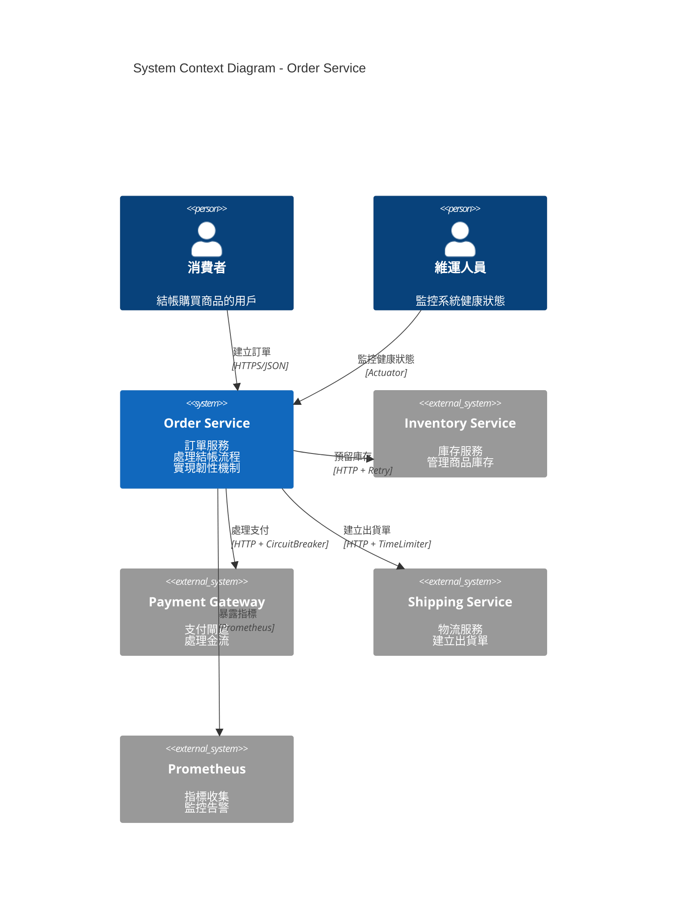
```mermaid
C4Context
    title System Context Diagram - Order Service

    Person(customer, "消費者", "結帳購買商品的用戶")
    Person(ops, "維運人員", "監控系統健康狀態")

    System(orderService, "Order Service", "訂單服務<br/>處理結帳流程<br/>實現韌性機制")

    System_Ext(inventoryService, "Inventory Service", "庫存服務<br/>管理商品庫存")
    System_Ext(paymentService, "Payment Gateway", "支付閘道<br/>處理金流")
    System_Ext(shippingService, "Shipping Service", "物流服務<br/>建立出貨單")
    System_Ext(prometheus, "Prometheus", "指標收集<br/>監控告警")

    Rel(customer, orderService, "建立訂單", "HTTPS/JSON")
    Rel(ops, orderService, "監控健康狀態", "Actuator")
    Rel(orderService, inventoryService, "預留庫存", "HTTP + Retry")
    Rel(orderService, paymentService, "處理支付", "HTTP + CircuitBreaker")
    Rel(orderService, shippingService, "建立出貨單", "HTTP + TimeLimiter")
    Rel(orderService, prometheus, "暴露指標", "Prometheus")
```

### C4 Model - Container Diagram

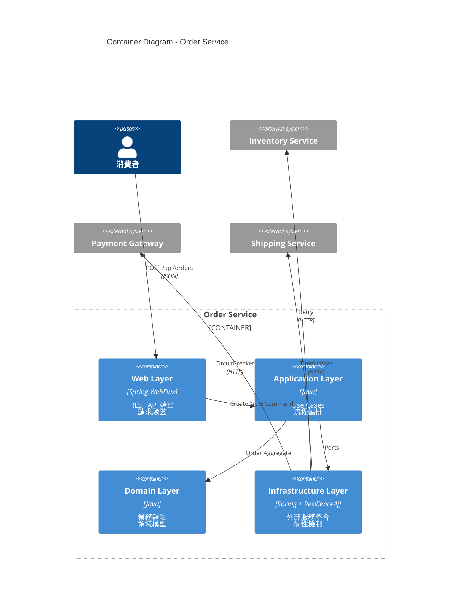
```mermaid
C4Container
    title Container Diagram - Order Service

    Person(customer, "消費者")

    Container_Boundary(orderService, "Order Service") {
        Container(webLayer, "Web Layer", "Spring WebFlux", "REST API 端點<br/>請求驗證")
        Container(appLayer, "Application Layer", "Java", "Use Cases<br/>流程編排")
        Container(domainLayer, "Domain Layer", "Java", "業務邏輯<br/>領域模型")
        Container(infraLayer, "Infrastructure Layer", "Spring + Resilience4j", "外部服務整合<br/>韌性機制")
    }

    System_Ext(inventory, "Inventory Service")
    System_Ext(payment, "Payment Gateway")
    System_Ext(shipping, "Shipping Service")

    Rel(customer, webLayer, "POST /api/orders", "JSON")
    Rel(webLayer, appLayer, "CreateOrderCommand")
    Rel(appLayer, domainLayer, "Order Aggregate")
    Rel(appLayer, infraLayer, "Ports")
    Rel(infraLayer, inventory, "Retry", "HTTP")
    Rel(infraLayer, payment, "CircuitBreaker", "HTTP")
    Rel(infraLayer, shipping, "TimeLimiter", "HTTP")
```

### 六角形架構 (Hexagonal Architecture)

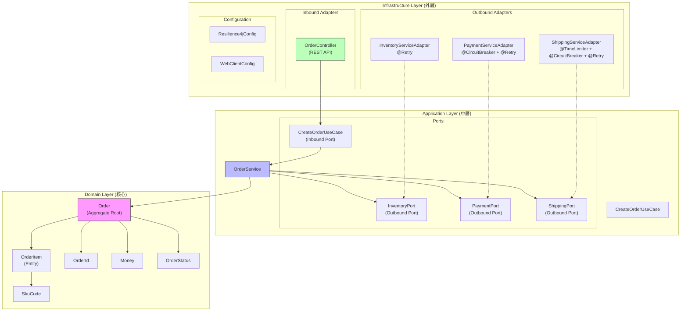
```mermaid
graph TB
    subgraph "Infrastructure Layer (外層)"
        subgraph "Inbound Adapters"
            REST["OrderController<br/>(REST API)"]
        end

        subgraph "Outbound Adapters"
            INV["InventoryServiceAdapter<br/>@Retry"]
            PAY["PaymentServiceAdapter<br/>@CircuitBreaker + @Retry"]
            SHIP["ShippingServiceAdapter<br/>@TimeLimiter + @CircuitBreaker + @Retry"]
        end

        subgraph "Configuration"
            R4J["Resilience4jConfig"]
            WC["WebClientConfig"]
        end
    end

    subgraph "Application Layer (中層)"
        UC["CreateOrderUseCase"]
        SVC["OrderService"]
        subgraph "Ports"
            PIN["CreateOrderUseCase<br/>(Inbound Port)"]
            POUT1["InventoryPort<br/>(Outbound Port)"]
            POUT2["PaymentPort<br/>(Outbound Port)"]
            POUT3["ShippingPort<br/>(Outbound Port)"]
        end
    end

    subgraph "Domain Layer (核心)"
        AGG["Order<br/>(Aggregate Root)"]
        ENT["OrderItem<br/>(Entity)"]
        VO1["OrderId"]
        VO2["Money"]
        VO3["SkuCode"]
        ENUM["OrderStatus"]
    end

    REST --> PIN
    PIN --> SVC
    SVC --> AGG
    SVC --> POUT1
    SVC --> POUT2
    SVC --> POUT3
    INV -.-> POUT1
    PAY -.-> POUT2
    SHIP -.-> POUT3
    AGG --> ENT
    AGG --> VO1
    AGG --> VO2
    ENT --> VO3
    AGG --> ENUM

    style AGG fill:#f9f,stroke:#333
    style SVC fill:#bbf,stroke:#333
    style REST fill:#bfb,stroke:#333
```

---

## 領域模型

### ER Diagram

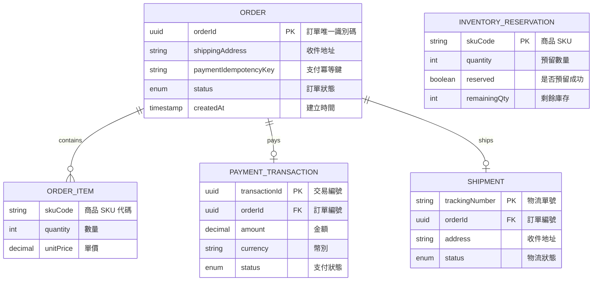
```mermaid
erDiagram
    ORDER ||--o{ ORDER_ITEM : contains
    ORDER {
        uuid orderId PK "訂單唯一識別碼"
        string shippingAddress "收件地址"
        string paymentIdempotencyKey "支付冪等鍵"
        enum status "訂單狀態"
        timestamp createdAt "建立時間"
    }
    ORDER_ITEM {
        string skuCode "商品 SKU 代碼"
        int quantity "數量"
        decimal unitPrice "單價"
    }

    INVENTORY_RESERVATION {
        string skuCode PK "商品 SKU"
        int quantity "預留數量"
        boolean reserved "是否預留成功"
        int remainingQty "剩餘庫存"
    }

    PAYMENT_TRANSACTION {
        uuid transactionId PK "交易編號"
        uuid orderId FK "訂單編號"
        decimal amount "金額"
        string currency "幣別"
        enum status "支付狀態"
    }

    SHIPMENT {
        string trackingNumber PK "物流單號"
        uuid orderId FK "訂單編號"
        string address "收件地址"
        enum status "物流狀態"
    }

    ORDER ||--o| PAYMENT_TRANSACTION : pays
    ORDER ||--o| SHIPMENT : ships
```

### 訂單狀態機

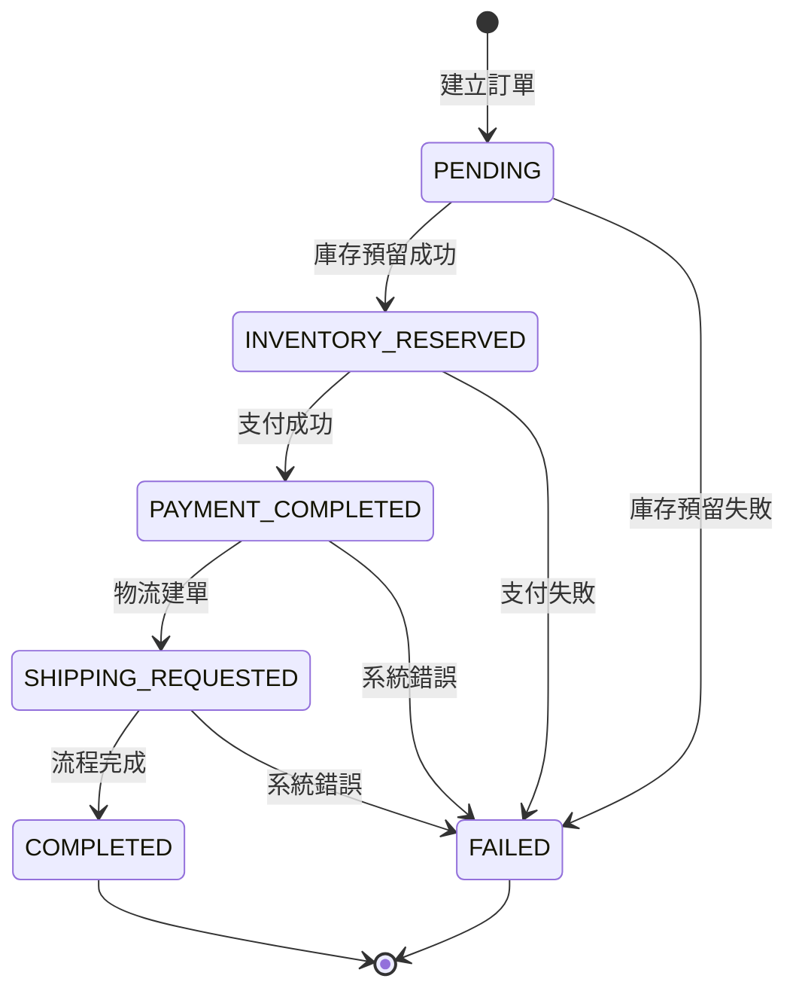
```mermaid
stateDiagram-v2
    [*] --> PENDING: 建立訂單

    PENDING --> INVENTORY_RESERVED: 庫存預留成功
    PENDING --> FAILED: 庫存預留失敗

    INVENTORY_RESERVED --> PAYMENT_COMPLETED: 支付成功
    INVENTORY_RESERVED --> FAILED: 支付失敗

    PAYMENT_COMPLETED --> SHIPPING_REQUESTED: 物流建單
    PAYMENT_COMPLETED --> FAILED: 系統錯誤

    SHIPPING_REQUESTED --> COMPLETED: 流程完成
    SHIPPING_REQUESTED --> FAILED: 系統錯誤

    COMPLETED --> [*]
    FAILED --> [*]
```

---

## In-flight 請求保護機制

本專案實作了三種策略來確保 K8s Pod 損毀時請求不遺失：

### 策略 1: Graceful Shutdown（優雅關閉）

處理計畫性重啟（如 Rolling Update）時的請求保護。

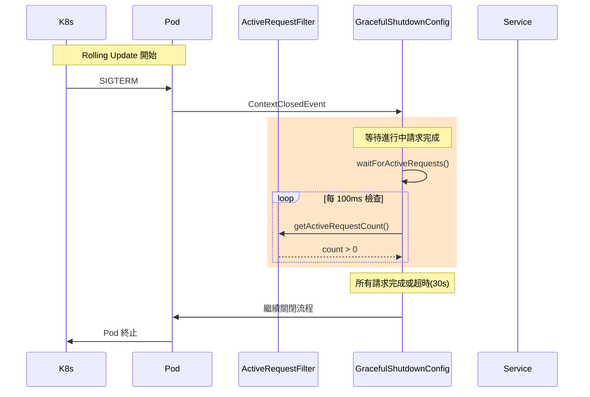
```mermaid
sequenceDiagram
    participant K8s
    participant Pod
    participant ActiveRequestFilter
    participant GracefulShutdownConfig
    participant Service

    Note over K8s,Pod: Rolling Update 開始
    K8s->>Pod: SIGTERM
    Pod->>GracefulShutdownConfig: ContextClosedEvent

    rect rgb(255, 230, 200)
        Note over GracefulShutdownConfig: 等待進行中請求完成
        GracefulShutdownConfig->>GracefulShutdownConfig: waitForActiveRequests()
        loop 每 100ms 檢查
            GracefulShutdownConfig->>ActiveRequestFilter: getActiveRequestCount()
            ActiveRequestFilter-->>GracefulShutdownConfig: count > 0
        end
    end

    Note over GracefulShutdownConfig: 所有請求完成或超時(30s)
    GracefulShutdownConfig->>Pod: 繼續關閉流程
    Pod->>K8s: Pod 終止
```

**核心元件：**
- `ActiveRequestFilter`: WebFilter 追蹤所有進行中的 HTTP 請求
- `GracefulShutdownConfig`: 監聽關閉事件，等待請求完成

### 策略 2: Idempotency（冪等性）

確保 Client 可以安全重試，不會造成重複處理。

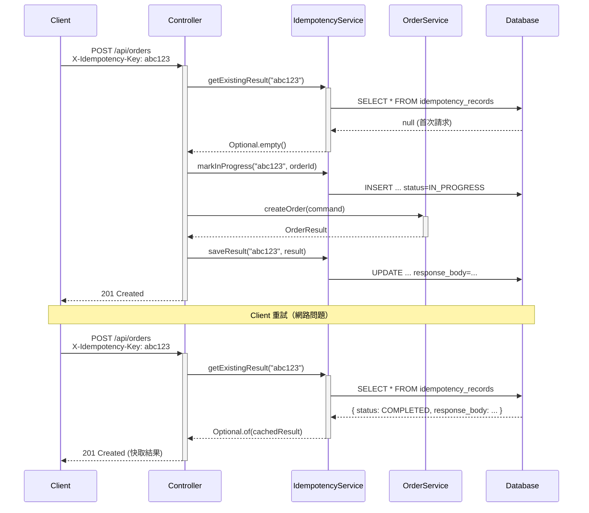
```mermaid
sequenceDiagram
    participant Client
    participant Controller
    participant IdempotencyService
    participant OrderService
    participant Database

    Client->>+Controller: POST /api/orders<br/>X-Idempotency-Key: abc123
    Controller->>+IdempotencyService: getExistingResult("abc123")
    IdempotencyService->>Database: SELECT * FROM idempotency_records
    Database-->>IdempotencyService: null (首次請求)
    IdempotencyService-->>-Controller: Optional.empty()

    Controller->>IdempotencyService: markInProgress("abc123", orderId)
    IdempotencyService->>Database: INSERT ... status=IN_PROGRESS

    Controller->>+OrderService: createOrder(command)
    OrderService-->>-Controller: OrderResult

    Controller->>IdempotencyService: saveResult("abc123", result)
    IdempotencyService->>Database: UPDATE ... response_body=...

    Controller-->>-Client: 201 Created

    Note over Client,Database: Client 重試（網路問題）

    Client->>+Controller: POST /api/orders<br/>X-Idempotency-Key: abc123
    Controller->>+IdempotencyService: getExistingResult("abc123")
    IdempotencyService->>Database: SELECT * FROM idempotency_records
    Database-->>IdempotencyService: { status: COMPLETED, response_body: ... }
    IdempotencyService-->>-Controller: Optional.of(cachedResult)
    Controller-->>-Client: 201 Created (快取結果)
```

**核心元件：**
- `IdempotencyService`: 管理冪等性紀錄的查詢與儲存
- `IdempotencyRecord`: JPA Entity 儲存請求結果

### 策略 3: Outbox Pattern + Saga

確保訂單與事件在同一交易中寫入，實現最終一致性。

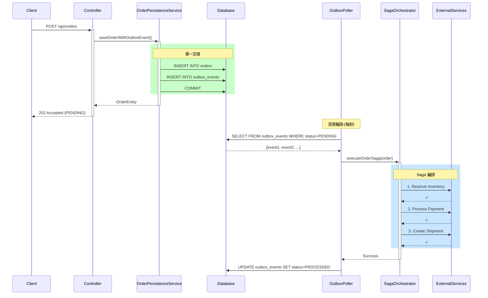
```mermaid
sequenceDiagram
    participant Client
    participant Controller
    participant OrderPersistenceService
    participant Database
    participant OutboxPoller
    participant SagaOrchestrator
    participant ExternalServices

    Client->>+Controller: POST /api/orders
    Controller->>+OrderPersistenceService: saveOrderWithOutboxEvent()

    rect rgb(200, 255, 200)
        Note over OrderPersistenceService,Database: 單一交易
        OrderPersistenceService->>Database: INSERT INTO orders
        OrderPersistenceService->>Database: INSERT INTO outbox_events
        OrderPersistenceService->>Database: COMMIT
    end

    OrderPersistenceService-->>-Controller: OrderEntity
    Controller-->>-Client: 202 Accepted (PENDING)

    Note over OutboxPoller: 背景輪詢 (每秒)

    OutboxPoller->>Database: SELECT FROM outbox_events WHERE status=PENDING
    Database-->>OutboxPoller: [event1, event2, ...]

    OutboxPoller->>+SagaOrchestrator: executeOrderSaga(order)

    rect rgb(200, 230, 255)
        Note over SagaOrchestrator,ExternalServices: Saga 編排
        SagaOrchestrator->>ExternalServices: 1. Reserve Inventory
        ExternalServices-->>SagaOrchestrator: ✓
        SagaOrchestrator->>ExternalServices: 2. Process Payment
        ExternalServices-->>SagaOrchestrator: ✓
        SagaOrchestrator->>ExternalServices: 3. Create Shipment
        ExternalServices-->>SagaOrchestrator: ✓
    end

    SagaOrchestrator-->>-OutboxPoller: Success
    OutboxPoller->>Database: UPDATE outbox_events SET status=PROCESSED
```

**核心元件：**
- `OrderPersistenceService`: 單一交易寫入訂單與 Outbox 事件
- `OutboxPoller`: 背景輪詢處理待處理事件
- `SagaOrchestrator`: 編排分散式交易步驟與補償

### Saga 補償機制

當 Saga 步驟失敗時，自動執行補償操作：

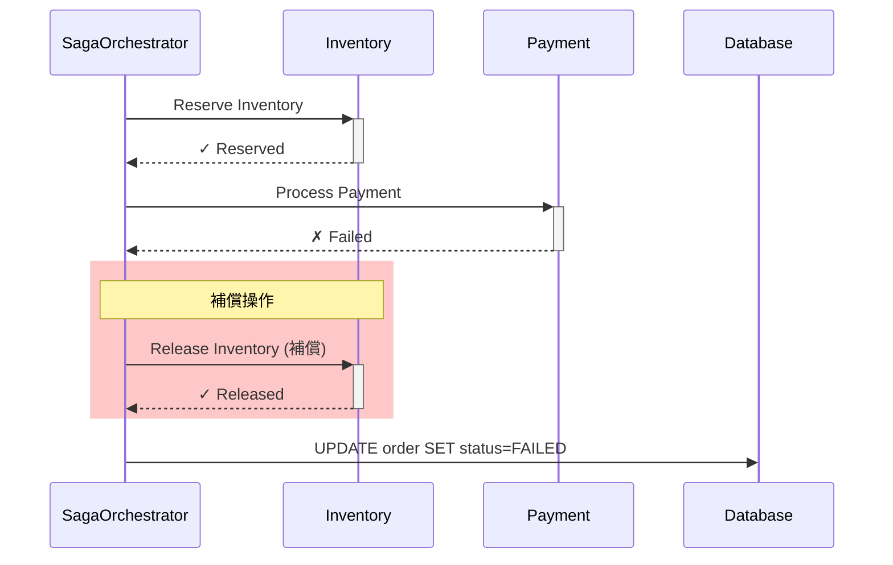
```mermaid
sequenceDiagram
    participant SagaOrchestrator
    participant Inventory
    participant Payment
    participant Database

    SagaOrchestrator->>+Inventory: Reserve Inventory
    Inventory-->>-SagaOrchestrator: ✓ Reserved

    SagaOrchestrator->>+Payment: Process Payment
    Payment-->>-SagaOrchestrator: ✗ Failed

    rect rgb(255, 200, 200)
        Note over SagaOrchestrator,Inventory: 補償操作
        SagaOrchestrator->>+Inventory: Release Inventory (補償)
        Inventory-->>-SagaOrchestrator: ✓ Released
    end

    SagaOrchestrator->>Database: UPDATE order SET status=FAILED
```

---

## 類別圖

### Domain Layer

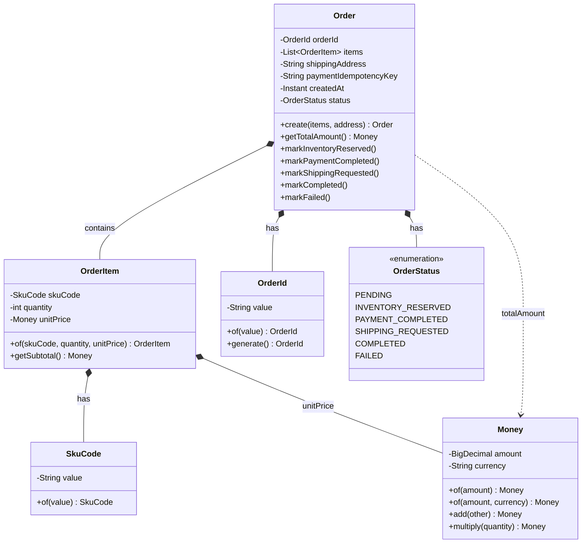
```mermaid
classDiagram
    class Order {
        -OrderId orderId
        -List~OrderItem~ items
        -String shippingAddress
        -String paymentIdempotencyKey
        -Instant createdAt
        -OrderStatus status
        +create(items, address) Order
        +getTotalAmount() Money
        +markInventoryReserved()
        +markPaymentCompleted()
        +markShippingRequested()
        +markCompleted()
        +markFailed()
    }

    class OrderItem {
        -SkuCode skuCode
        -int quantity
        -Money unitPrice
        +of(skuCode, quantity, unitPrice) OrderItem
        +getSubtotal() Money
    }

    class OrderId {
        -String value
        +of(value) OrderId
        +generate() OrderId
    }

    class SkuCode {
        -String value
        +of(value) SkuCode
    }

    class Money {
        -BigDecimal amount
        -String currency
        +of(amount) Money
        +of(amount, currency) Money
        +add(other) Money
        +multiply(quantity) Money
    }

    class OrderStatus {
        <<enumeration>>
        PENDING
        INVENTORY_RESERVED
        PAYMENT_COMPLETED
        SHIPPING_REQUESTED
        COMPLETED
        FAILED
    }

    Order *-- OrderItem : contains
    Order *-- OrderId : has
    Order *-- OrderStatus : has
    OrderItem *-- SkuCode : has
    OrderItem *-- Money : unitPrice
    Order ..> Money : totalAmount
```

### Application Layer

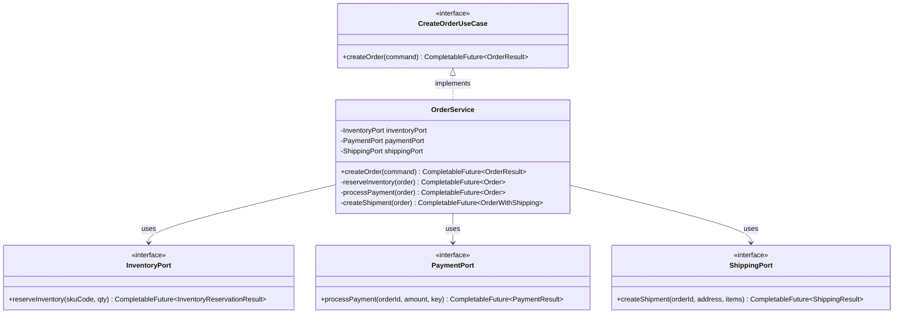
```mermaid
classDiagram
    class CreateOrderUseCase {
        <<interface>>
        +createOrder(command) CompletableFuture~OrderResult~
    }

    class OrderService {
        -InventoryPort inventoryPort
        -PaymentPort paymentPort
        -ShippingPort shippingPort
        +createOrder(command) CompletableFuture~OrderResult~
        -reserveInventory(order) CompletableFuture~Order~
        -processPayment(order) CompletableFuture~Order~
        -createShipment(order) CompletableFuture~OrderWithShipping~
    }

    class InventoryPort {
        <<interface>>
        +reserveInventory(skuCode, qty) CompletableFuture~InventoryReservationResult~
    }

    class PaymentPort {
        <<interface>>
        +processPayment(orderId, amount, key) CompletableFuture~PaymentResult~
    }

    class ShippingPort {
        <<interface>>
        +createShipment(orderId, address, items) CompletableFuture~ShippingResult~
    }

    CreateOrderUseCase <|.. OrderService : implements
    OrderService --> InventoryPort : uses
    OrderService --> PaymentPort : uses
    OrderService --> ShippingPort : uses
```

### Infrastructure Layer - Adapters

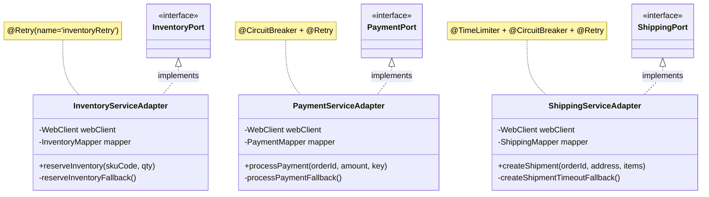
```mermaid
classDiagram
    class InventoryServiceAdapter {
        -WebClient webClient
        -InventoryMapper mapper
        +reserveInventory(skuCode, qty)
        -reserveInventoryFallback()
    }

    class PaymentServiceAdapter {
        -WebClient webClient
        -PaymentMapper mapper
        +processPayment(orderId, amount, key)
        -processPaymentFallback()
    }

    class ShippingServiceAdapter {
        -WebClient webClient
        -ShippingMapper mapper
        +createShipment(orderId, address, items)
        -createShipmentTimeoutFallback()
    }

    class InventoryPort {
        <<interface>>
    }

    class PaymentPort {
        <<interface>>
    }

    class ShippingPort {
        <<interface>>
    }

    InventoryPort <|.. InventoryServiceAdapter : implements
    PaymentPort <|.. PaymentServiceAdapter : implements
    ShippingPort <|.. ShippingServiceAdapter : implements

    note for InventoryServiceAdapter "@Retry(name='inventoryRetry')"
    note for PaymentServiceAdapter "@CircuitBreaker + @Retry"
    note for ShippingServiceAdapter "@TimeLimiter + @CircuitBreaker + @Retry"
```

---

## 循序圖

### 正常流程

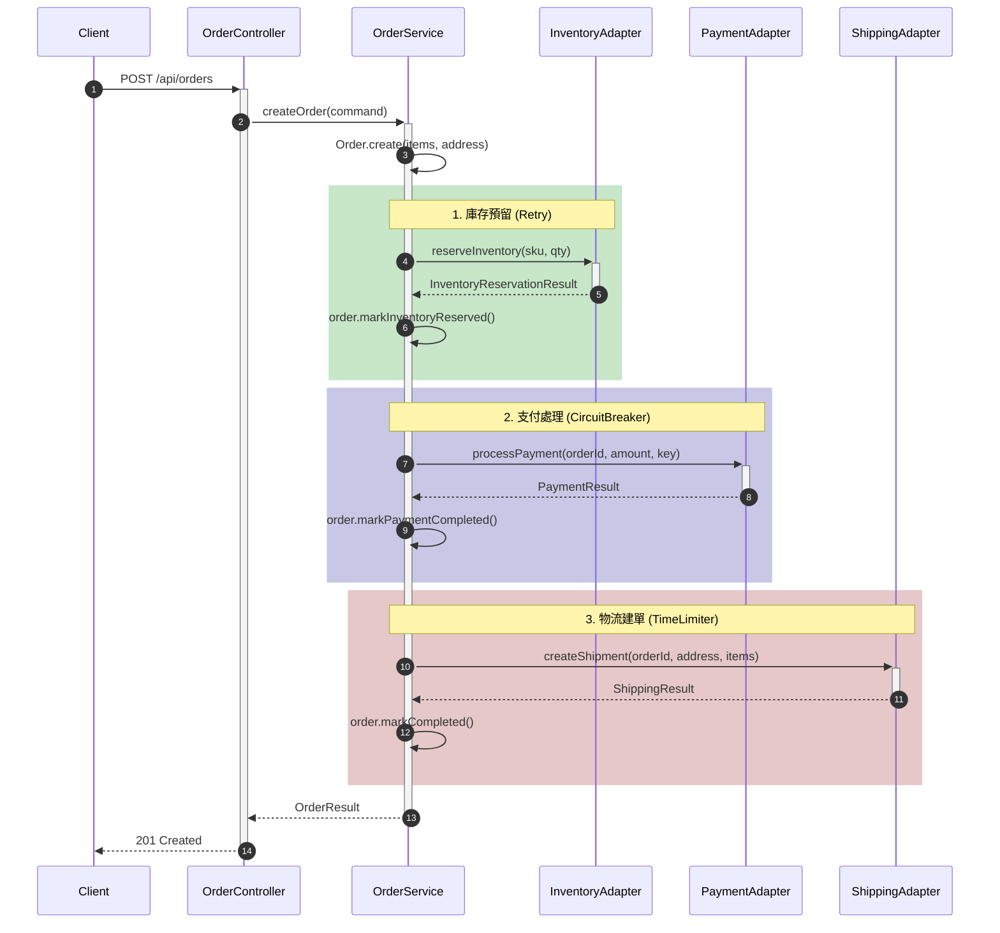
```mermaid
sequenceDiagram
    autonumber
    participant Client
    participant Controller as OrderController
    participant Service as OrderService
    participant Inventory as InventoryAdapter
    participant Payment as PaymentAdapter
    participant Shipping as ShippingAdapter

    Client->>+Controller: POST /api/orders
    Controller->>+Service: createOrder(command)

    Service->>Service: Order.create(items, address)

    rect rgb(200, 230, 200)
        Note over Service,Inventory: 1. 庫存預留 (Retry)
        Service->>+Inventory: reserveInventory(sku, qty)
        Inventory-->>-Service: InventoryReservationResult
        Service->>Service: order.markInventoryReserved()
    end

    rect rgb(200, 200, 230)
        Note over Service,Payment: 2. 支付處理 (CircuitBreaker)
        Service->>+Payment: processPayment(orderId, amount, key)
        Payment-->>-Service: PaymentResult
        Service->>Service: order.markPaymentCompleted()
    end

    rect rgb(230, 200, 200)
        Note over Service,Shipping: 3. 物流建單 (TimeLimiter)
        Service->>+Shipping: createShipment(orderId, address, items)
        Shipping-->>-Service: ShippingResult
        Service->>Service: order.markCompleted()
    end

    Service-->>-Controller: OrderResult
    Controller-->>-Client: 201 Created
```

### Retry 機制 - 暫時性故障恢復

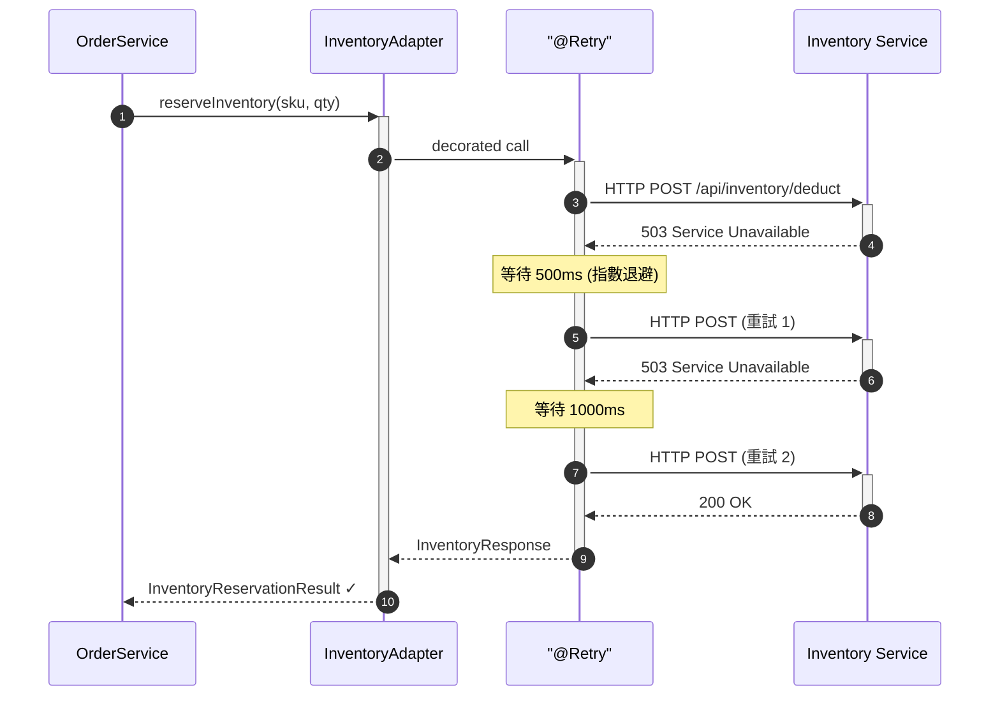
```mermaid
sequenceDiagram
    autonumber
    participant Service as OrderService
    participant Adapter as InventoryAdapter
    participant R4J as "@Retry"
    participant External as Inventory Service

    Service->>+Adapter: reserveInventory(sku, qty)
    Adapter->>+R4J: decorated call

    R4J->>+External: HTTP POST /api/inventory/deduct
    External-->>-R4J: 503 Service Unavailable

    Note over R4J: 等待 500ms (指數退避)

    R4J->>+External: HTTP POST (重試 1)
    External-->>-R4J: 503 Service Unavailable

    Note over R4J: 等待 1000ms

    R4J->>+External: HTTP POST (重試 2)
    External-->>-R4J: 200 OK

    R4J-->>-Adapter: InventoryResponse
    Adapter-->>-Service: InventoryReservationResult ✓
```

### CircuitBreaker 機制 - 快速失敗保護

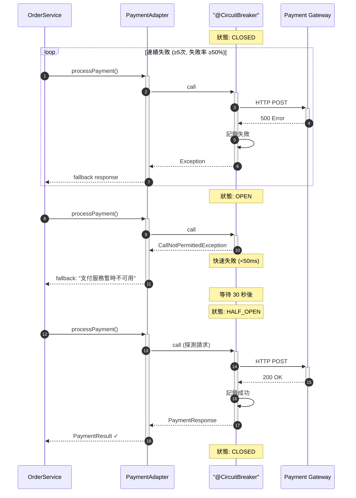
```mermaid
sequenceDiagram
    autonumber
    participant Service as OrderService
    participant Adapter as PaymentAdapter
    participant CB as "@CircuitBreaker"
    participant External as Payment Gateway

    Note over CB: 狀態: CLOSED

    loop 連續失敗 (≥5次, 失敗率 ≥50%)
        Service->>+Adapter: processPayment()
        Adapter->>+CB: call
        CB->>+External: HTTP POST
        External-->>-CB: 500 Error
        CB->>CB: 記錄失敗
        CB-->>-Adapter: Exception
        Adapter-->>-Service: fallback response
    end

    Note over CB: 狀態: OPEN

    Service->>+Adapter: processPayment()
    Adapter->>+CB: call
    CB-->>-Adapter: CallNotPermittedException
    Note over CB: 快速失敗 (<50ms)
    Adapter-->>-Service: fallback: "支付服務暫時不可用"

    Note over CB: 等待 30 秒後

    Note over CB: 狀態: HALF_OPEN

    Service->>+Adapter: processPayment()
    Adapter->>+CB: call (探測請求)
    CB->>+External: HTTP POST
    External-->>-CB: 200 OK
    CB->>CB: 記錄成功
    CB-->>-Adapter: PaymentResponse
    Adapter-->>-Service: PaymentResult ✓

    Note over CB: 狀態: CLOSED
```

### TimeLimiter 機制 - 超時降級

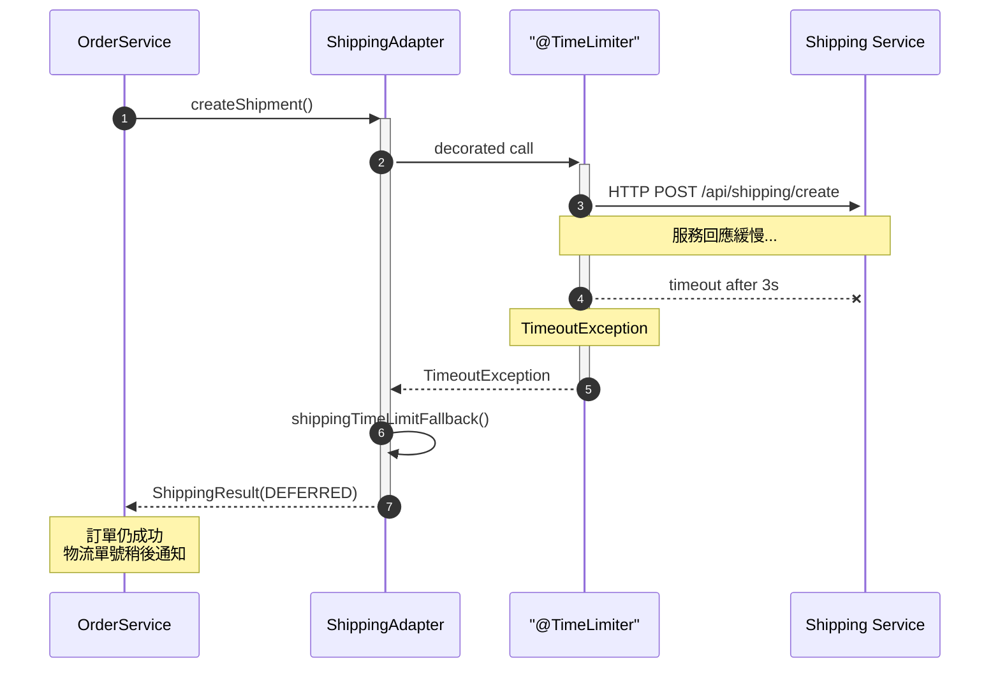
```mermaid
sequenceDiagram
    autonumber
    participant Service as OrderService
    participant Adapter as ShippingAdapter
    participant TL as "@TimeLimiter"
    participant External as Shipping Service

    Service->>+Adapter: createShipment()
    Adapter->>+TL: decorated call
    TL->>+External: HTTP POST /api/shipping/create

    Note over TL,External: 服務回應緩慢...

    TL--xExternal: timeout after 3s
    Note over TL: TimeoutException

    TL-->>-Adapter: TimeoutException
    Adapter->>Adapter: shippingTimeLimitFallback()
    Adapter-->>-Service: ShippingResult(DEFERRED)

    Note over Service: 訂單仍成功<br/>物流單號稍後通知
```

---

## API 清單

### Order API

| Method | Endpoint | Description | Headers | Request | Response |
|--------|----------|-------------|---------|---------|----------|
| POST | `/api/orders` | 建立訂單 | X-Idempotency-Key (optional) | CreateOrderRequest | CreateOrderResponse |

### 冪等性 Header

| Header | 說明 | 範例 |
|--------|------|------|
| `X-Idempotency-Key` | 冪等鍵，用於安全重試。建議使用 UUID | `X-Idempotency-Key: 550e8400-e29b-41d4-a716-446655440000` |

**行為說明：**
- 若提供 `X-Idempotency-Key`，系統會檢查是否已處理過該請求
- 若已處理，直接返回快取的結果（不重複執行）
- 快取結果保留 24 小時
- 若未提供，每次請求都會建立新訂單

### Actuator Endpoints

| Endpoint | Description |
|----------|-------------|
| GET `/actuator/health` | 健康檢查 |
| GET `/actuator/activerequests` | 當前進行中請求數（Graceful Shutdown 用）|
| GET `/actuator/circuitbreakers` | 斷路器狀態 |
| GET `/actuator/retries` | 重試配置 |
| GET `/actuator/timelimiters` | 超時控制配置 |
| GET `/actuator/prometheus` | Prometheus 指標 |
| GET `/actuator/metrics` | 應用程式指標 |

### Request/Response 範例

**Request (同步模式):**
```bash
curl -X POST http://localhost:8080/api/orders \
  -H "Content-Type: application/json" \
  -H "X-Idempotency-Key: 550e8400-e29b-41d4-a716-446655440000" \
  -d '{
    "items": [
      {"skuCode": "SKU001", "quantity": 2, "unitPrice": 1500.00}
    ],
    "shippingAddress": "台北市信義區松仁路100號"
  }'
```

**Response (Success - 同步模式):**
```json
{
  "orderId": "550e8400-e29b-41d4-a716-446655440000",
  "status": "COMPLETED",
  "totalAmount": 3000.00,
  "currency": "TWD",
  "trackingNumber": "TRK123456789",
  "message": "Order created successfully",
  "createdAt": "2026-02-02T12:00:00Z"
}
```

**Response (Success - 非同步模式，Outbox 啟用時):**
```json
{
  "orderId": "550e8400-e29b-41d4-a716-446655440000",
  "status": "PENDING",
  "totalAmount": 3000.00,
  "currency": "TWD",
  "trackingNumber": null,
  "message": "訂單已建立，正在處理中。請稍後查詢訂單狀態。",
  "createdAt": "2026-02-02T12:00:00Z"
}
```

**Response (Deferred Shipping):**
```json
{
  "orderId": "550e8400-e29b-41d4-a716-446655440000",
  "status": "COMPLETED",
  "totalAmount": 3000.00,
  "currency": "TWD",
  "trackingNumber": null,
  "message": "Order created. Tracking number will be provided later via notification.",
  "createdAt": "2026-02-02T12:00:00Z"
}
```

**Response (冪等性 - 重複請求返回快取結果):**
```json
{
  "orderId": "550e8400-e29b-41d4-a716-446655440000",
  "status": "COMPLETED",
  "totalAmount": 3000.00,
  "currency": "TWD",
  "trackingNumber": "TRK123456789",
  "message": "Order created successfully",
  "createdAt": "2026-02-02T12:00:00Z"
}
```
*註：使用相同 `X-Idempotency-Key` 重試時，返回與首次請求相同的結果*

---

## Resilience4j 配置

### Retry 配置

| 實例 | maxAttempts | waitDuration | backoffMultiplier | 適用場景 |
|------|-------------|--------------|-------------------|----------|
| inventoryRetry | 3 | 500ms | 2.0 | 庫存服務暫時性錯誤 |
| paymentRetry | 3 | 1000ms | 2.0 | 支付閘道暫時性錯誤 |
| shippingRetry | 2 | 500ms | - | 物流服務暫時性錯誤 |

### CircuitBreaker 配置

| 實例 | failureRateThreshold | slowCallRateThreshold | waitDurationInOpenState | 適用場景 |
|------|---------------------|----------------------|------------------------|----------|
| inventoryCB | 60% | 80% | 30s | 庫存服務保護 |
| paymentCB | 50% | 80% | 30s | 支付閘道保護（較敏感）|
| shippingCB | 60% | 80% | 30s | 物流服務保護 |

### TimeLimiter 配置

| 實例 | timeoutDuration | cancelRunningFuture | 適用場景 |
|------|-----------------|---------------------|----------|
| inventoryTL | 4s | true | 涵蓋完整重試週期 |
| paymentTL | 8s | true | 涵蓋完整重試週期 |
| shippingTL | 3s | true | 快速降級處理 |

### 裝飾器執行順序

```
TimeLimiter → CircuitBreaker → Retry → HTTP Call
```

---

## In-flight 保護配置

### Graceful Shutdown 配置

```yaml
spring:
  lifecycle:
    timeout-per-shutdown-phase: 30s  # 等待進行中請求的最大時間

server:
  shutdown: graceful  # 啟用優雅關閉
```

### Outbox Pattern 配置

```yaml
outbox:
  enabled: false           # 是否啟用 Outbox Pattern (true=非同步模式)
  poller:
    enabled: true          # 是否啟用 Outbox 輪詢器
    interval-ms: 1000      # 輪詢間隔（毫秒）
    batch-size: 10         # 每次輪詢處理的事件數量
    max-retries: 3         # 事件處理最大重試次數
```

### JPA 配置

```yaml
spring:
  datasource:
    url: jdbc:postgresql://localhost:5432/orderdb
    username: postgres
    password: postgres
  jpa:
    hibernate:
      ddl-auto: create-drop  # 開發環境自動建立 Schema
    properties:
      hibernate:
        dialect: org.hibernate.dialect.PostgreSQLDialect
```

---

## 測試案例

### 測試統計

```
Total Tests: 37+
├── Unit Tests: 15
│   └── OrderTest (Domain Layer)
└── Integration Tests: 22+
    ├── RetryIntegrationTest: 5
    ├── CircuitBreakerIntegrationTest: 6
    ├── TimeLimiterIntegrationTest: 5
    ├── CombinedResilienceTest: 5
    ├── IdempotencyIntegrationTest: 1+
    └── OutboxPatternIntegrationTest: 3 (需啟用 async mode)
```

### 測試環境

| 模式 | 資料庫 | 啟用方式 |
|------|--------|----------|
| 預設 | H2 In-Memory | `./gradlew test` |
| Testcontainers | PostgreSQL | `./gradlew test -Dtestcontainers.enabled=true` |
| Outbox 測試 | H2 / PostgreSQL | `./gradlew test -Doutbox.tests.enabled=true` |

### 測試場景對照表

| 測試類別 | 測試案例 | 驗證目標 |
|----------|----------|----------|
| **RetryIntegrationTest** | | |
| | should_retry_and_succeed_on_transient_failure | 暫時性故障自動重試成功 |
| | should_not_retry_on_4xx_business_error | 4xx 錯誤不重試 |
| | should_not_retry_on_409_insufficient_stock | 庫存不足不重試 |
| | should_return_error_when_retry_exhausted | 重試耗盡返回錯誤 |
| | should_use_exponential_backoff | 指數退避策略 |
| **CircuitBreakerIntegrationTest** | | |
| | should_open_when_failure_rate_exceeds_threshold | 失敗率超標開啟斷路器 |
| | should_fast_fail_when_open | 開啟時快速失敗 (<100ms) |
| | should_return_proper_error_message | 返回適當錯誤訊息 |
| | should_transition_to_half_open | 等待後進入半開狀態 |
| | should_close_when_probe_succeeds | 探測成功時關閉 |
| | should_succeed_when_healthy | 服務正常時成功 |
| **TimeLimiterIntegrationTest** | | |
| | should_timeout_and_fallback_on_slow_response | 慢回應超時降級 |
| | should_return_deferred_message | 返回延後處理訊息 |
| | should_record_timeout_as_failure | 超時計入失敗統計 |
| | should_succeed_when_quick_response | 快速回應時成功 |
| | should_cancel_running_future | 超時時取消請求 |
| **CombinedResilienceTest** | | |
| | should_operate_independently | 各服務斷路器獨立運作 |
| | should_skip_retry_when_cb_open | 斷路器開啟跳過重試 |
| | should_preserve_idempotency_key | 冪等鍵一致性 |
| | should_handle_combined_failures | 組合故障場景 |
| | should_record_metrics | 記錄韌性事件指標 |
| **IdempotencyIntegrationTest** | | |
| | should_return_cached_result_for_duplicate_request | 重複請求返回快取結果 |
| **OutboxPatternIntegrationTest** | | |
| | should_create_order_and_outbox_in_single_transaction | 訂單與 Outbox 事件同交易 |
| | should_process_outbox_events_via_saga | Saga 非同步處理 Outbox 事件 |
| | should_handle_saga_failure_with_compensation | Saga 失敗執行補償 |

### 執行測試

```bash
# 執行所有測試（使用 H2 In-Memory Database）
./gradlew test

# 執行特定測試類別
./gradlew test --tests "RetryIntegrationTest"
./gradlew test --tests "CircuitBreakerIntegrationTest"
./gradlew test --tests "TimeLimiterIntegrationTest"
./gradlew test --tests "CombinedResilienceTest"
./gradlew test --tests "IdempotencyIntegrationTest"

# 執行單元測試
./gradlew test --tests "OrderTest"

# 使用 Testcontainers (需要 Docker)
./gradlew test -Dtestcontainers.enabled=true

# 執行 Outbox Pattern 測試 (非同步模式)
./gradlew test --tests "OutboxPatternIntegrationTest" -Doutbox.tests.enabled=true
```

---

## 專案結構

```
src/
├── main/java/com/example/order/
│   ├── domain/                          # 領域層 (純業務邏輯)
│   │   ├── model/
│   │   │   ├── Order.java              # 聚合根
│   │   │   ├── OrderItem.java          # 實體
│   │   │   ├── OrderId.java            # 值物件
│   │   │   ├── Money.java              # 值物件
│   │   │   ├── SkuCode.java            # 值物件
│   │   │   └── OrderStatus.java        # 列舉
│   │   └── exception/
│   │       ├── DomainException.java
│   │       └── InsufficientStockException.java
│   │
│   ├── application/                     # 應用層 (用例編排)
│   │   ├── port/
│   │   │   ├── in/
│   │   │   │   └── CreateOrderUseCase.java
│   │   │   └── out/
│   │   │       ├── InventoryPort.java
│   │   │       ├── PaymentPort.java
│   │   │       └── ShippingPort.java
│   │   ├── service/
│   │   │   ├── OrderService.java
│   │   │   ├── IdempotencyService.java          # 冪等性服務
│   │   │   ├── OrderPersistenceService.java     # 訂單持久化 + Outbox
│   │   │   ├── OutboxPoller.java                # Outbox 輪詢器
│   │   │   └── SagaOrchestrator.java            # Saga 編排器
│   │   └── dto/
│   │       ├── CreateOrderCommand.java
│   │       └── OrderResult.java
│   │
│   └── infrastructure/                  # 基礎設施層 (框架整合)
│       ├── adapter/
│       │   ├── in/web/
│       │   │   ├── OrderController.java
│       │   │   ├── dto/
│       │   │   └── mapper/
│       │   └── out/
│       │       ├── inventory/
│       │       ├── payment/
│       │       └── shipping/
│       ├── config/
│       │   ├── Resilience4jEventConfig.java
│       │   ├── WebClientConfig.java
│       │   ├── GracefulShutdownConfig.java      # 優雅關閉配置
│       │   └── OpenApiConfig.java
│       ├── filter/
│       │   └── ActiveRequestFilter.java         # 請求追蹤 Filter
│       ├── persistence/
│       │   ├── entity/
│       │   │   ├── OrderEntity.java             # 訂單 JPA Entity
│       │   │   ├── OrderItemEntity.java         # 訂單項目 Entity
│       │   │   ├── OutboxEvent.java             # Outbox 事件 Entity
│       │   │   ├── OutboxEventStatus.java       # Outbox 狀態列舉
│       │   │   └── IdempotencyRecord.java       # 冪等性紀錄 Entity
│       │   └── repository/
│       │       ├── OrderJpaRepository.java
│       │       ├── OutboxRepository.java
│       │       └── IdempotencyRepository.java
│       └── exception/
│           ├── GlobalExceptionHandler.java
│           ├── RetryableServiceException.java
│           ├── NonRetryableServiceException.java
│           ├── BusinessException.java
│           └── ServiceUnavailableException.java
│
└── test/java/com/example/order/
    ├── integration/
    │   ├── RetryIntegrationTest.java
    │   ├── CircuitBreakerIntegrationTest.java
    │   ├── TimeLimiterIntegrationTest.java
    │   ├── CombinedResilienceTest.java
    │   ├── IdempotencyIntegrationTest.java      # 冪等性測試
    │   └── OutboxPatternIntegrationTest.java    # Outbox 模式測試
    ├── unit/domain/
    │   └── OrderTest.java
    └── support/
        ├── WireMockTestSupport.java             # H2 + WireMock 測試基類
        └── PostgresTestContainerSupport.java    # PostgreSQL Testcontainers 基類
```

---

## 技術棧

| 類別 | 技術 | 版本 |
|------|------|------|
| Language | Java | 17+ |
| Framework | Spring Boot | 3.2.x |
| Reactive | Spring WebFlux | 6.1.x |
| Resilience | Resilience4j | 2.2.x |
| Persistence | Spring Data JPA + Hibernate | 3.2.x |
| Database | PostgreSQL / H2 | 15+ / 2.x |
| API Documentation | SpringDoc OpenAPI | 2.3.x |
| Metrics | Micrometer + Prometheus | 1.12.x |
| Testing | JUnit 5 + WireMock + Testcontainers | 5.10 / 3.3.x / 1.19.x |
| Async Testing | Awaitility | 4.2.x |
| Build | Gradle | 8.5 |

---

## 學習資源

### 相關概念

- [Hexagonal Architecture](https://alistair.cockburn.us/hexagonal-architecture/)
- [Domain-Driven Design](https://martinfowler.com/bliki/DomainDrivenDesign.html)
- [Circuit Breaker Pattern](https://martinfowler.com/bliki/CircuitBreaker.html)
- [Retry Pattern](https://docs.microsoft.com/en-us/azure/architecture/patterns/retry)
- [Outbox Pattern](https://microservices.io/patterns/data/transactional-outbox.html)
- [Saga Pattern](https://microservices.io/patterns/data/saga.html)
- [Idempotency Pattern](https://microservices.io/patterns/reliability/idempotent-consumer.html)
- [Kubernetes Graceful Shutdown](https://kubernetes.io/docs/concepts/containers/container-lifecycle-hooks/)

### Resilience4j 文件

- [Resilience4j Documentation](https://resilience4j.readme.io/)
- [Resilience4j with Spring Boot](https://resilience4j.readme.io/docs/getting-started-3)

### Spring Boot

- [Spring WebFlux](https://docs.spring.io/spring-framework/reference/web/webflux.html)
- [Spring Boot Actuator](https://docs.spring.io/spring-boot/docs/current/reference/html/actuator.html)

---

## License

Apache 2.0
